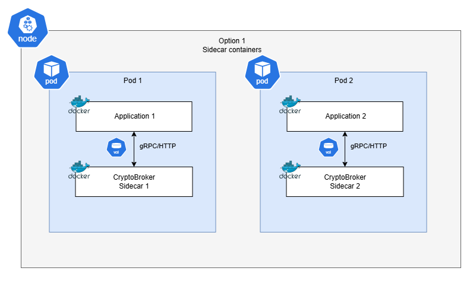
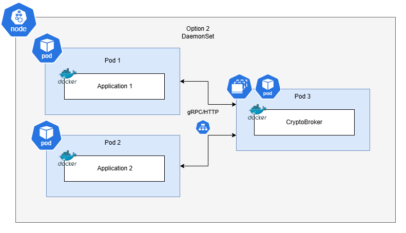

# Different Options for K8s Deployment

## Context and Problem Statement

The goal of this ADR is to review the current proposed Main Application + Crypto Broker as sidecar architecture. Moreover, this document offers some insights on how it can be done and other alternatives that can be considered. Since the [CF-Deployment ADR](./0002-cf-deployment.md) already established the pattern for Cloud-Foundry, this ADR focuses on the deployment on Kubernetes only, both locally and Kyma.

## Decision Drivers

* The Crypto Broker application should be deployed with a high priority to cybersecurity to guarantee the safety of the exchanged information between broker and client.
* The Crypto Broker should be easy to deploy in a Kubernetes cluster using standard tools.
* The Crypto Broker has the minimum possible impact on the running application's infrastructure

## Considered Options

### Sidecar

Each running application has a sidecar Crypto Broker container inside the same pod. Both containers share one temporal volume through which they connect via unix sockets. The data exchanged between broker and client is not encrypted, but it can only be read from inside the Pod, increasing the security. As a side note, auto-injection of the sidecar could be enabled but it is quite complex, both to program and to deploy for users.

### DaemonSet

Each node (machine) in the kubernetes cluster has a running pod of the Crypto Broker. The multiple applications/pods inside the node connect to the same Crypto Broker running on a separate pod. Although connection through a shared volume could be possible, an connection through *localhost* would be easier and (potentially) safer.

Data between broker and client would not leave the machine, however, the communication would also be unencrypted. Recent [cybersecurity projects](https://spiffe.io/docs/latest/spire-about/spire-concepts/#spire-architecture-and-components) do not consider this a risk though. Still, if in-transit encryption is desired, there are multiple options:

* The [Container Network Interface (CNI)](https://kubernetes.io/docs/concepts/extend-kubernetes/compute-storage-net/network-plugins/). For example Cillium and Calico can enable Wireguard for encryption in-transit.

* Via (m)TLS authentication, natively supported by both HTTPS and gRPC.

Each option presented here does not invalidate the other. Both options could be offered so the users can decide based on their expertise/needs. Different profiles could be specified for each option depending on their usecase.

*TLS encryption*: in-transit encryption is usually done via TLS. To achieve this, certificates should be used in order to secure the connection. The broker itself could issue the certificates necessary for that, if we allow it to trust himself.
A more advanced version is mutual TLS (mTLS), which involves each part having its own certificates for encryption and decryption. (m)TLS could have a small impact on the performance of the application.

## Decision Outcome

As it was pointed out, in order to make this decision, the team currently lacks context and real use-cases from teams wanting to deploy the application in Kubernetes. Moreover, one option does not invalidate another, so users can still choose their preferred way of deploying the Crypto Broker. Finally, at the current development stage, this has no influence in the further development of the broker, so a final decision on this topic is not required right now.

With this in mind, it has been decided to stick to Sidecar as it is a known use-case required right now. However, this ADR will serve as documentation that this option is not exclusive and that there are alternatives depending on the client's requirements.

### Consequences

Development will continue as planned. These deployment options do not have any requirement on the features or communication protocols, so this ADR could be re-opened in the future, when new real Kubernetes use-cases are provided.

### Confirmation

Confirmed as of Friday 06.06.2025 in the Sprint Review.

## Pros and Cons of the Options

### Sidecar Deployment

#### Pros

* The sidecar runs in the same Pod as the application, sharing a temporal volume only accessible to them. This constrains the broker's scope to the application only.
* Similar pattern to Cloud Foundry.
* If the user is experienced with K8s, it gives them more control over the deployment (resource limits, fine grained Pod security).

#### Cons

* Each application has its own sidecar -> More hardware resources used.
* It requires more Kubernetes expertise to deploy and ensure security. Cannot be done by a single command.
* Kubernetes capabilities are not utilized by us -> Our end product would be just a Docker Image (and possibly some K8s best-practices guides).
* Enabling auto-injection of sidecars is possible but harder to implement for us and install for users.

### DaemonSet Deployment

#### Pros

* One crypto-broker per machine. Better hardware utilization, and multiple applications can use the same crypto-broker. Optimizations, such as Multi-threading, of the crypto-broker could be implemented to increase its performance.
* Connection through localhost never leaves the same machine.
* Requires less Kubernetes expertise. We can enforce more security and best-practices via K8s resources (ie Network Policies, Secrets and more).

#### Cons

* Crypto-broker runs as a separate Pod in the same machine. Network Polices (and maybe other security measures) are recommended. Data is still only available inside the node. Optionally, in-transit encryption could be implemented for increased security. (mTLS, safe-volumes,...).
* Implementation with unix socket is possible but harder. Using a `hostPath` volume [is not recommended](https://kubernetes.io/docs/concepts/storage/volumes/#hostpath), thus, probably a Persistent Volume would be required. A localhost connection would be easier and equally safe.
