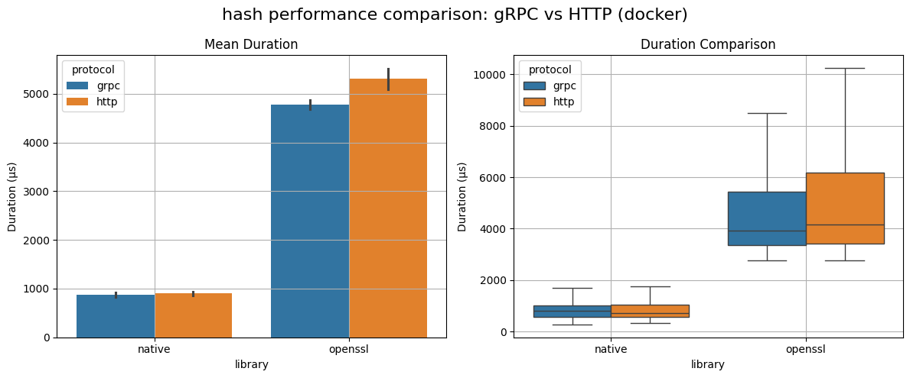
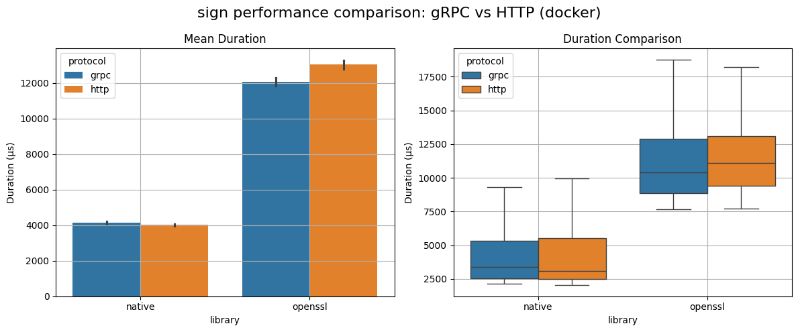
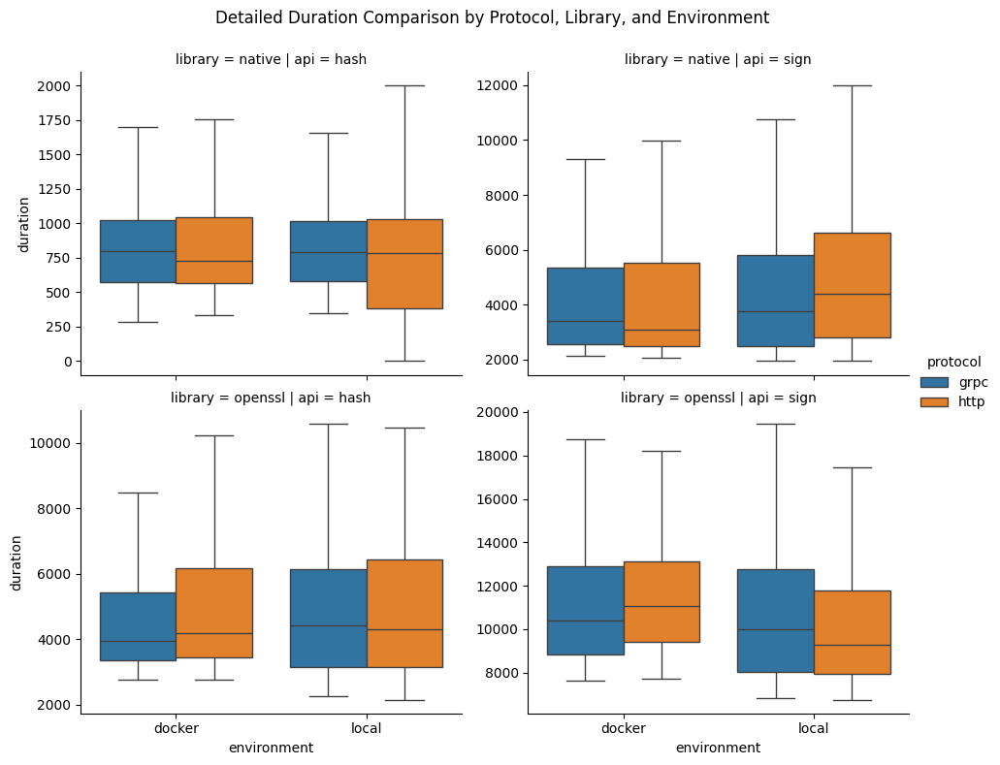
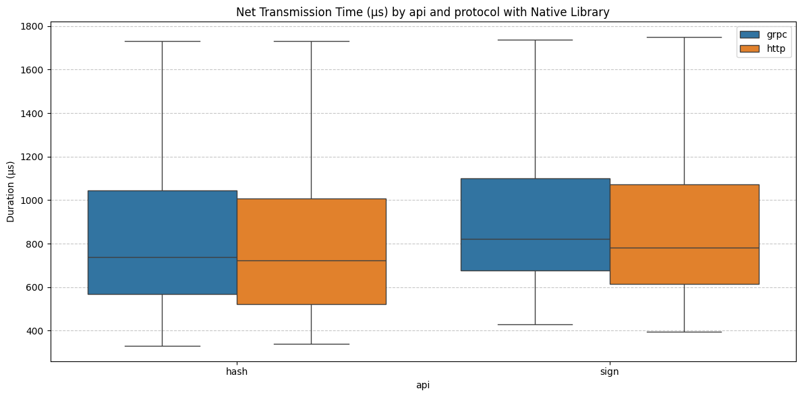
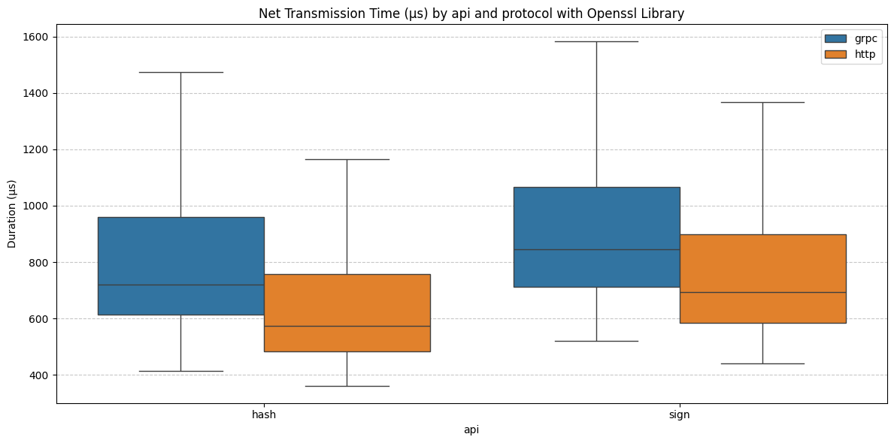
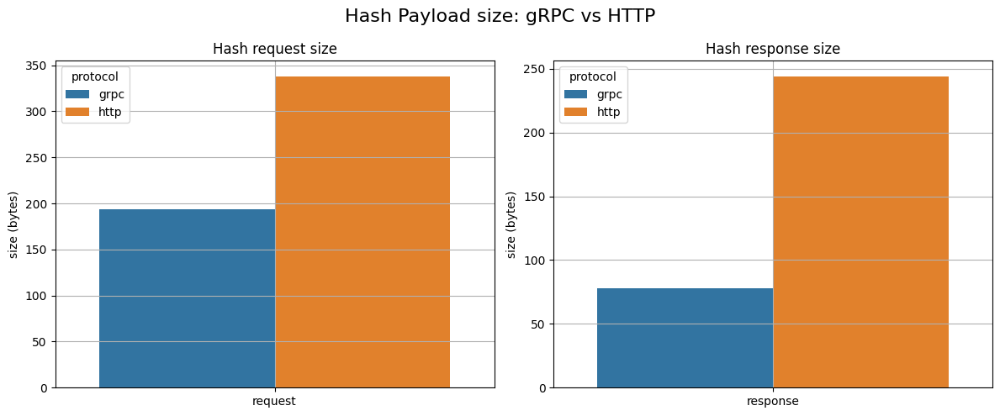
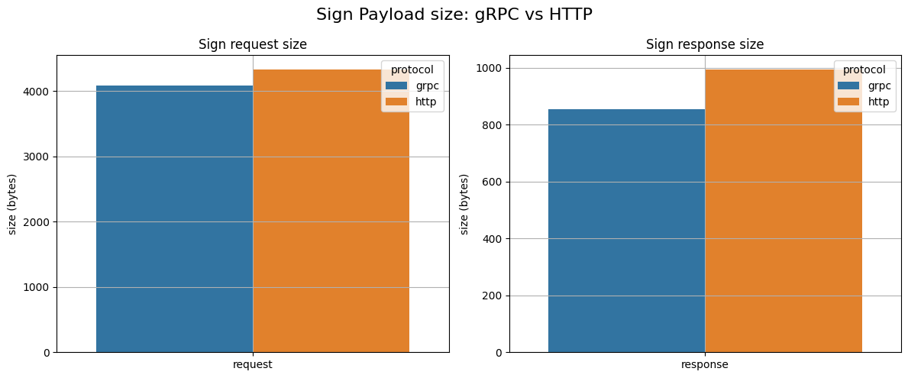

# Options for IPC protocol

## Context and Problem Statement

This ADR addresses the choice of IPC protocol for communication between the application and the Crypto Broker. Since both components will run in a cloud environment on the same host but within separate pods, they will communicate via a Unix socket. The selected protocol must strike a balance between performance, maintainability, tooling support, and observability to ensure efficient and reliable communication.

## Decision Drivers

* Performance (latency and throughput)
* Interoperability with different languages
* Payload efficiency
* Security
* Observability and debugging

## Considered Options

* gRPC (over HTTP/2)
* HTTP (over HTTP/1.1)

## Decision Outcome

Chosen option: gRPC

### Consequences

* Modern, fast, supports binary data, etc.
* For a full list of reasons, see below

### Confirmation

* Confirmed by: Maximilian Lenkeit, Maik Müller, Stephan Andre

## Pros and Cons of the Options

### gRPC

#### Pros

* Efficient binary serialization via Protocol Buffers (smaller, faster)
* Protobuf supports "bytes" as data format
* Native support for HTTP/2: multiplexed streams, lower latency
* Bi-directional streaming support
* Compatibility with multiple programming languages
* Standardized interface definition via `.proto` files

#### Cons

* Harder to debug without tools (non-human-readable payloads)
* More complex deployment setup in some environments
* Limited readability and testing

### HTTP

#### Pros

* Human-readable (JSON), easier to test/debug via curl, Postman, browser
* Broad toolchain support, well understood by most developers
* Simpler service-to-service communication if observability or debugging is critical

#### Cons

* Higher overhead due to JSON serialization/deserialization
* No native support for streaming or multiplexing
* Less efficient in high-throughput or low-latency scenarios

## More Information

* gRPC supports binary format in messages, whereas HTTP with JSON requires an encoding. Using e.g. base64 encoding for binary content adds a computational overhead.
* For small payloads, the latency difference between gRPC and HTTP is marginal. The larger the payload, the more noticable the benefit of gRPC over HTTP. Currently, the payload consists of a couple hundred bytes and one request/response at a time, which makes HTTP perform better. However for e.g. hashing or encrypting large files, this could create a remarkable difference.
* gRPC performs better with concurrent requests. Therefore, this decision also depends on the eventual deployment and usage of the Crypto Broker.
* In case an additional security layer over (m)TLS is required, encryption and decryption of compact protobuf payloads would be much faster than on larger JSON payloads.

## Data Comparison

In order to compare the two IPC protocols by means of valuable data, we gathered 1000 samples (duration benchmarks) per combination. Combinations consist of the following properties:

* protocol: grpc/http
* api: hash/sign
* library: native/openssl
* environment: docker/local

Note that using openssl as crypto provider adds a large computational overhead to the operation compared to native, which makes the proportion of the communication time minimal.

The following figures illustrate the results of this analysis.

### HTTP vs gRPC comparison with different api (hash/sign), library (native/openssl), and environment (docker/local)

### Net Transmission Time (client_duration - server_duration)

### Hashing Payload Size

### Certificate Generation Payload Size

Note: gRPC payload contains CSR, private key and CA certificate as bytes, whereas JSON contains the file contents as strings (as they are already encoded).
