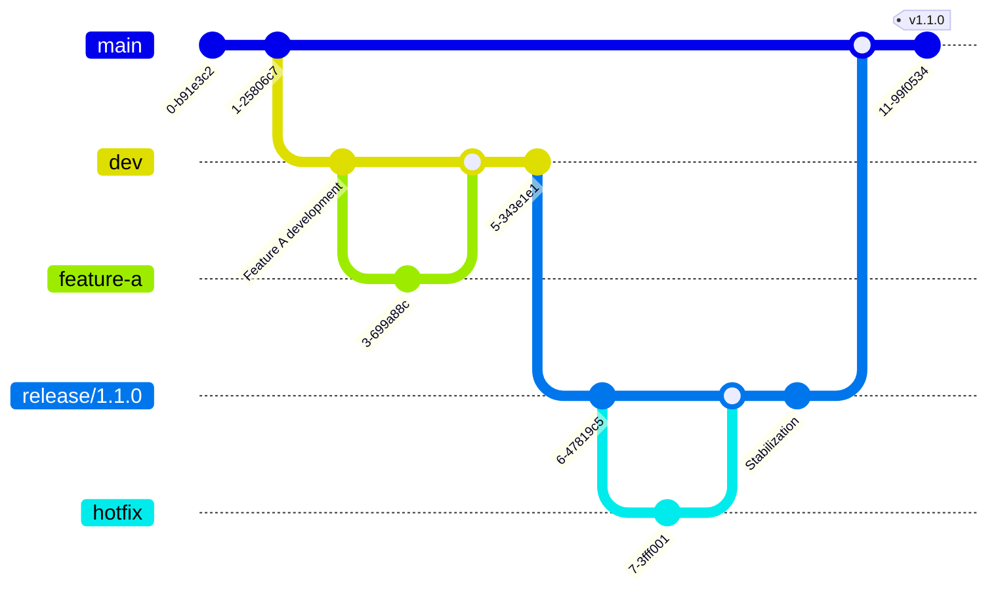
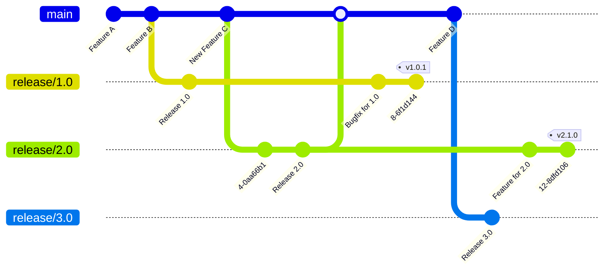

# Release Strategy for the Crypto Broker Server and its clients

## Context and Problem Statement

This ADR tackles the release policy that will be followed once the Crypto Broker goes open source. The goal is to define a common policy for the server and the multiple clients, so that is clear for all contributors and users what versions are available, how can these be used and their compatibility with each other.

## Decision Drivers

* Adherence to the standards in the industry and open-source community
* Easy to understand by users and developers
* Strict enough to ensure that both internal and external contributors follow it
* As little as possible complexity is added to the current project

## Pre-requisites

### Semantic Versioning (SemVer)

Semantic Versioning (SemVer) is a versioning scheme that helps developers define the nature of changes in a software release. It uses a three-part version number format: `Major.Minor.Patch` (e.g `1.4.2`), with each component defined as:

* `Major`: This number is increased when there are backwards incompatible changes. Once increased, both Minor and Patch versions are reset to 0.
* `Minor`: This number is increased when new functionality is added, but this does not break backwards compatibility. Once increased, Patch version is reset to 0.
* `Patch`: This number is increased when backwards compatible bug fixes are released but no new functionality is added.

The first stable version to be published is always version `1.0.0`. Previously, Major version `0.x.x` can be used when the project is still in an early development phase and the product cannot be fully used yet.

Some projects also add hyphenated labels at the end of the version to indicate a pre-release status, for example `1.0.0-alpha.1`. This optional label can be used to indicate that a version is not stable yet.

### Conventional Commits

The [Conventional Commits specification](https://www.conventionalcommits.org/en/v1.0.0/#summary) is a lightweight convention on top of commit messages. It provides an easy set of rules for creating an explicit commit history,  which makes it easier to write automated tools on top of. This convention complements SemVer, by describing the features, fixes, and breaking changes made in commit messages.

For any commit made to the repository, a `keyword:` must precede the commit. Common keywords are `fix:` for bug fixes and `feat:` for new features, but other keywords are also possible. To introduce breaking changes, the `!` symbol can be appended to the keyword - i.e. `fix!:`.

For a full description of all the options and possibilities, the [specification](https://www.conventionalcommits.org/en/v1.0.0/#specification) can be checked.

## Considered Options

* Single release branch (simplicity, easy to follow)
* Temporary release branches (parallelization, more testing time)
* Long-term release branches (maintenance, structure)

## Decision Outcome

Chosen option: "Single Release Branch"

As discussed in the round, all of the options can be implemented at any point in time if needed. Thus, option 3 is only needed if at some point multiple major versions are supported at the same time and they need their own hotfixes. However, this is not the case so far, so the simple "Single Release Branch" option, which has been used so far, will suffice for the moment. If a more advanced option is needed in the future, the Release Strategy will be changed and documented to reflect this new reality.

### Consequences

* As this is how the team currently operates, few changes are needed. Conventional commits and SemVer need to be implemented.
* Git Tags are now mandatory when releasing new versions of the software.
* The strategy needs to be documented so that internal developers and external contributors follow it.

## Confirmation

Confirmed by Stephan Andre and Maximilian Lenkeit on 13.08.2025 .

## Pros and Cons

### Single Release Branch

In this strategy, the branch `main` is used as a stable branch to which the different versions are released. Each new version is released with a commit and a tag to track it. The binaries and outputs of this release can be generated automatically via CI/CD pipelines and published to any of the artifact options.

For development, a `pre-release`/`dev` branch is set. Each feature or fix is developed on its own branch, and these are merged to the `dev` branch as they are approved. The `dev` branch can then be merged on `main` after thorough testing, either on regular intervals or as the release manager sees fit.

#### Pros

* The main branch is always up to date with the latest stable version of the software
* Easier management of the repository due to small number of branches at the same time
* Easy to stack newer versions on top of older ones and always develop from the latest code

#### Cons

* New features should not be merged into `dev` when a release is planned
* Harder to push fixes to older versions (checkout older commit, create new fixes, merge back to main)
* Harder to develop multiple Major versions at the same time

### Temporary release branches

This model is very similar to the previous one. In here, the `main` branch is also used to keep the latest stable version of the software. However, the branch is not merged from the development branch `dev`, but from the `release` branches created from the development branch.

New features or fixes are developed on their own branches, which then are merged on the development branch `dev`. The features are then branched out into their own release branch `release/x.x.x`. This branch is used to stabilize the release and potentially offer a beta testing version to some users. Hotfixes and patches can be directly merged onto this branch without going through `dev` first.

Once stabilized, the release branch is then merged on the `main` branch and the branch is deleted after a while. As in the other strategy, the creation of artifacts and branch deletion can be automated through the CI/CD pipelines.

#### Pros

* Easier parallel development of new features and bug fixes for new releases
* Can set short (e.g. 2 weeks) time windows to stabilize and offer support for new releases
* Easier management of the repository, on the long-term only a few branches are active (same as previous option)

#### Cons

* Need to make sure hotfixes from a release branch are merged into both `main` and `dev`
* Higher git experience required
* Can lead to more branch clutter if not managed properly. For this reason, automation and fixed time windows are strongly encouraged

### Long-term release branches

This model takes the feature from release branches and uses them to offer more long-term support for different releases. In here, only a `main` branch is used as a centralized development branch. From there, once a new release is ready, this is branched out on its own release branch.

Release branches are long lived (as long as its version is supported) and do not have to be necessarily merged back into `main`. Bugfixes and release-specific features are added directly to their release branches. This means that is the responsibility of the developers to evaluate whether these fixes should be also applied to the `main` branch to carry them to future releases.

#### Pros

* Easier maintenance of multiple releases at the same time
* Clear definition of each's release code and git history

#### Cons

* Harder maintenance for developers
* More error-prone and chaotic due to multiple branches being active at the same time
* Needs clear communication among developers and a strict release strategy documentation

## More Information
