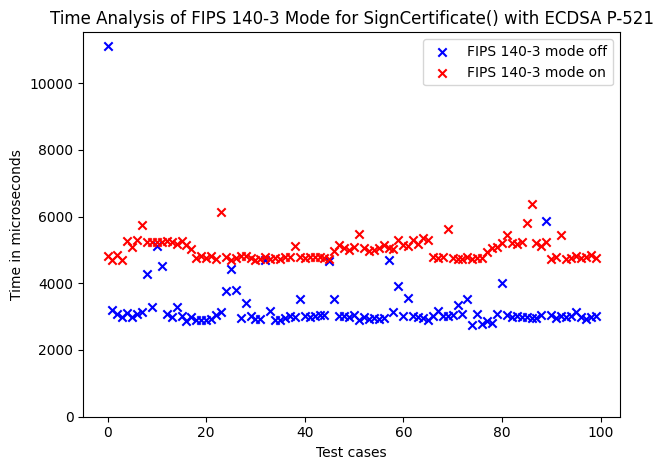
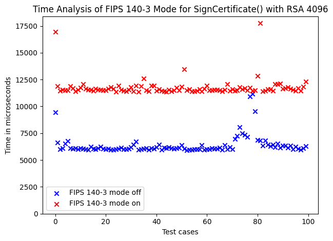
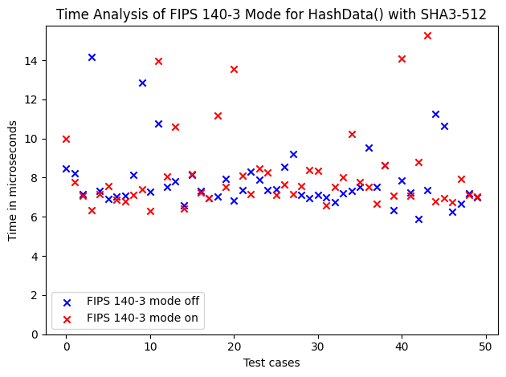

# Enabling FIPS 140-3 Mode in Go

## Context and Problem Statement

The Crypto Broker will run in environments that require FIPS 140-3 compliance when it comes to the execution of cryptographic algorithms.
This means only approved and CMVP-validated algorithms shall be used.
`Go 1.24` includes a native Go Cryptographic Module, which is also implemented in the Crypto Broker server.
The Go Cryptographic Module v1.0.0 is currently on the [CMVP Modules in Process](https://csrc.nist.gov/Projects/cryptographic-module-validation-program/modules-in-process/modules-in-process-list) list and awaiting NIST review (pending since 08.05.2025).
The native Go module will replace the previously commonly used but never officially supported Go+BoringCrypto module.
There are multiple ways to enable FIPS-support for an application, mainly a build-time and run-time option.
The [FIPS 140-3 Compliance Go Security Documentation](https://go.dev/doc/security/fips140) provides a description of possibilities to enable FIPS 140-3 mode in `Go` applications.
In addition, a [FIPS 140-3 Go Cryptographic Module Blog Post](https://go.dev/blog/fips140) illustrates a developer's perspective on using FIPS 140-3 mode in `Go`.

## Decision Drivers

* The crypto operations must use a verified and frozen cryptographic module.
    * Any change of a `Go` version or any used module should not influence the state of FIPS 140-3 validation of the crypto module.
    * For example, `Go 1.25` might contain improvements to `crypto/internal/fips140/...`, which however has not been CMVP-validated yet. Therefore, a specifically linked module version guarantees a stable and verified cryptographic module.
* Enabling FIPS 140-3 mode should not lie in the hands of the client application or in the way the application is deployed in the cloud instance.

## Considered Options

* Run-time enabling via `GODEBUG` environment variable.
* Build-time linking to a specific validated module version with `GOFIPS140`.

## Decision Outcome

Chosen option: Build-time linking to a specific validated module version with `GOFIPS140`.
The binary is built via the following command:

```bash
GOFIPS140=v1.0.0 go build -o bin/cryptobroker-server cmd/server/server.go
```

The linked version can be traced via:

```bash
go version -m bin/cryptobroker-server
```

### Consequences

* A verified and frozen snapshot of the Go Cryptographic Module is directly linked to the binary.
    * Can point this version to a specific CMVP certificate to prove compliance.
    * No ambiguity in running code from later `Go` releases changing `crypto/internal/fips140`.
    * Internal crypto code does not change between builds unless you explicitly change the `GOFIPS140` version, helping stable and reproducible builds across releases.
* Executing the binary does not require any additional run-time steps to enable FIPS 140-3 mode.
    * No need for developers to remember to execute the binary with the `GODEBUG` environment variable in production.
* The Crypto Broker continues to operate as is, but is linked to a stable version of the Go Cryptographic Module instead of using the latest release. For the moment, no operational issues should arise. Running self-checks and known-answer tests may slightly increase startup times.

## Pros and Cons of the Options

### Run-time only

The cryptography module version v1.0.0 supports run-time FIPS 140-3 mode, which can be enabled at run-time via the environment variable `GODEBUG=fips140=on` (manually by developers) or the `go.mod` file (for an automatic check in the toolchain).
It triggers integrity self-checks and known-answer tests on initialization, switches `crypto/rand` to NIST DRBG + kernel entropy and only allows approved algorithms for TLS.
Possible values for `fips140` are `on`,  `off` and `only`.
The environment variable defaults to `off` and cannot be changed after the program has started.
This mode does not operate in FIPS 140-3 mode.
When the `fips140`-setting `only` (experimental) is used, any algorithms that are not FIPS 140-3 compliant will return an error or panic.
This run-time option is not supported on OpenBSD, Wasm, AIX and 32-bit Windows platforms.
During run-time, one can check whether FIPS 140-3 mode is active via the `crypto/fips140.Enabled` function.

Building:

```bash
go build -o bin/cryptobroker-server cmd/server/server.go
```

Running:

```bash
GODEBUG=fips140=on CRYPTO_BROKER_PROFILES_DIR=$PWD/profiles ./bin/cryptobroker-server
```

#### Pros

* More flexible: same binary can run either mode.
    * Can be dynamically tested with newer (unverified) versions of the Go Cryptographic Module.
* Runs self-tests, uses DRBG with kernel entropy, only accepts approved algorithms in TLS.

#### Cons

* Machines must set the environment variable explicitly when executing the binary.
    * When deploying the binary, the cloud instance must execute the program with the environment variable set.
* Does not link any specific frozen or validated module version to the binary.
    * `Go` version updates might change the cryptographic functions and therefore link to an unverified module version.
    * Harder to show to auditors that the binary uses a CMVP-validated module version.

### Build-time

Support for FIPS 140-3 is set at build-time (`go build`, `go install`, `go test`) and is linked directly in the binary.
The developer can choose explicitly which cryptographic module version is compiled into the binary via the `GOFIPS140` variable.
For example, `GOFIPS140=v1.0.0 go build` automatically links the exact snapshot of the Go Cryptographic Module v1.0.0 as shipped in `lib/fips140/v1.0.0.zip`, which was submitted to CMVP validation.
Using this approach defaults `GODEBUG=fips140` to `on`.
Other values for `GOFIPS140` are `off` (default), which uses the potentially unverified `crypto/internal/fips140/...` module version of the current `Go` release, and `latest`, which behaves like `off`, but enables FIPS 140-3 mode by default in run-time.

Building:

```bash
GOFIPS140=v1.0.0 go build -o bin/cryptobroker-server cmd/server/server.go
```

Running:

```bash
CRYPTO_BROKER_PROFILES_DIR=$PWD/profiles ./bin/cryptobroker-server
```

#### Pros

* Compiled binary contains a frozen validated module and is not influenced by any changes in other `Go` versions. Easy to prove, verify and link a specific validated module version.
* Sets the `GODEBUG=fips140` variable to `on` by default and combines both steps (build-time + run-time) automatically.
    * Runs tests for integrity and functionality on `init` and only executes FIPS 140-3 approved algorithms.

#### Cons

* Cannot run in non-FIPS 140-3 mode once built.
    * No fallback for operational hotfixes if FIPS mode causes problems.

## Additional Information

### Output of `go version --m bin/cryptobroker-server`

#### Binary built without `go build -o bin/cryptobroker-server cmd/server/server.go`

```bash
$ go version -m bin/cryptobroker-server
bin/cryptobroker-server: go1.24.2
        path    command-line-arguments
        dep     github.com/goccy/go-yaml [...]
        dep     crypto-broker-server [...]
        dep     golang.org/x/net [...]
        dep     golang.org/x/sys [...]
        dep     golang.org/x/text [...]
        dep     google.golang.org/genproto/googleapis/rpc [...]
        dep     google.golang.org/grpc [...]
        dep     google.golang.org/protobuf [...]
        build   -buildmode=exe
        build   -compiler=gc
        build   CGO_ENABLED=1
        build   CGO_CFLAGS=
        build   CGO_CPPFLAGS=
        build   CGO_CXXFLAGS=
        build   CGO_LDFLAGS=
        build   GOARCH=amd64
        build   GOOS=linux
        build   GOAMD64=v1
```

#### Binary built with `GOFIPS140=v1.0.0 go build -o bin/cryptobroker-server cmd/server/server.go`

```bash
$ go version -m bin/cryptobroker-server
bin/cryptobroker-server: go1.24.2
        path    command-line-arguments
        dep     github.com/goccy/go-yaml [...]
        dep     crypto-broker-server [...]
        dep     golang.org/x/net [...]
        dep     golang.org/x/sys [...]
        dep     golang.org/x/text [...]
        dep     google.golang.org/genproto/googleapis/rpc [...]
        dep     google.golang.org/grpc [...]
        dep     google.golang.org/protobuf [...]
        build   -buildmode=exe
        build   -compiler=gc
        build   -tags=fips140v1.0
        build   DefaultGODEBUG=fips140=on
        build   CGO_ENABLED=1
        build   CGO_CFLAGS=
        build   CGO_CPPFLAGS=
        build   CGO_CXXFLAGS=
        build   CGO_LDFLAGS=
        build   GOARCH=amd64
        build   GOFIPS140=v1.0.0
        build   GOOS=linux
        build   GOAMD64=v1
```

### Time Comparison

In order to compare time complexity for a comparison between FIPS mode and non-FIPS mode, we conducted experiments by running the respective client request 100 times per configuration (API, signature algorithm, FIPS mode on/off).
For that, we used a short script, available in the [documentation repository](https://github.com/open-crypto-broker/crypto-broker-documentation/blob/main/adr/overall/0007-fips140-3-mode-figures/execute_command.sh).

> Note: It seems like running request commands too frequently results in longer runtimes of a single command, maybe due to ressource limits or internal implementation issues. Therefore, to mitigate this measurement error, we delayed running the next command by 1 second. In addition, the first execution of a request after the server has been started is always the slowest by a noticeable factor.

Signing using FIPS 140-3 mode takes remarkably more time than without FIPS 140-3 mode.
This is probably due to additional self-checks, tests and using different implementations of the algorithms.
The analysis of `SignCertificate()` using ECDSA P-521 and RSA4096 is illustrated in the figures below.
It is to note, that according to [Go 1.25 Release Notes](https://go.dev/doc/go1.25), the performance of ECDSA (and Ed25519) signatures in the updated version of the cryptographic module (previously v1.0.0) has been optimized by factor 4, matching the performance of non-FIPS mode.
However, this updated version is not under CMVP review yet.




Regarding the hashing algorithms, no significant performance difference between FIPS mode and non-FIPS mode is visible.
The exemmplary analysis of SHA3-512 in `HashData()` is shown below.


