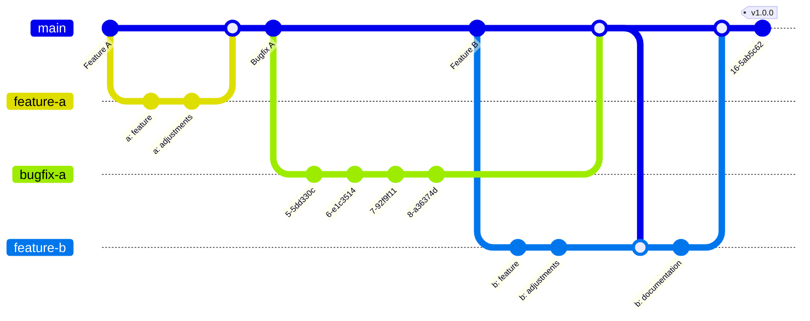

# Release Strategy for the Crypto Broker Server and its clients

## Context and Problem Statement

This ADR updates the previous [release strategy ADR](0006-release-strategy.md).
After using the "Single release branch" approach for several months, several issues and problems emerged.
The idea with the "Single release branch" was to have a development `dev` branch and push every change (feature, bugfix, documentation, workflow, etc.) to this `dev` branch.
Unfortunately, this approach makes it difficult to test and release new features faster.
The idea was to merge from time to time the `dev` branch into `main` and create a release.
This separation of development and deployment makes it harder to quickly identify and resolve issues (slower feedback).
Additionally, it is not possible to start GitHub Action workflows, if these files are not merged in the `default` i.e. `main` branch.

Problems:

* Slower addition of features
* If workflow files are not merged into `main`, these cannot be executed
* "Empty" `main` branch, can directly be replaced with `dev` branch

## Decision Drivers

* Make the deployment and release process faster
* Integrate features and bugfixes faster into `main`
* Keep commit messages from pull requests directly in `main` changelog

## Considered Options

* Main release branch (new in this ADR)
* Previous ADR:
    * Single release branch (simplicity, easy to follow)
    * Temporary release branches (parallelization, more testing time)
    * Long-term release branches (maintenance, structure)

## Decision Outcome

Chosen option: "Main Release Branch"

### Consequences

* Conventional commits and SemVer are followed, as already described in the previous ADR.
* A Git tag marks the point in time for a release.

## Confirmation

Confirmed by Stephan Andre and Maximilian Lenkeit on XX.11.2025.

## Pros and Cons

### Main Release Branch

This strategy is based on only one branch, the `main` branch.
Development and deployment takes place in the same branch.
All changes (features, bug-fixes, documentation, etc.) are created on branches directly from `main` and merged via pull requests back into `main`.
When a bugfix or feature is merged before another feature is complete, the feature branch needs to be rebased on `main`.

#### Pros

* No separation between development and release
* Quickly identify and resolve issues (fast feedback)
* No pull request from `dev` branch to `main` needed for release process
* Directly create a changelog and release from `main` branch
* GitHub Action workflows can only be started, if the files are merged in the `main` branch
* No new `dev` branch creation needed, after `main` was merged (if `dev` is not created anew, it will differ from `main` with one commit message, i.e. the merge from `dev` to `main`)

#### Cons

* It can happen that the `main` branch is not stable and fails to build/run
* No separation between development and release
* Not ideal for maintaining multiple versions
