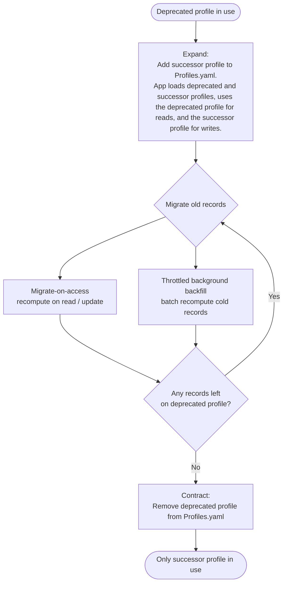

# Profile Change and Migration Guidance

## Context and Problem Statement

Cryptographic algorithms used by the Crypto Broker are defined per profile in the `Profiles.yaml` file (see [Profile Specification](../../spec/0001-profile.md)).
Applications select a profile by its **name** (a string) when calling the APIs, e.g. `HashData(profile="Default", ...)`.
The server loads all profiles at startup from the file `Profiles.yaml` in the directory referenced by `CRYPTO_BROKER_PROFILES_DIR` (see [Configuration Options ADR](0008-configuration-options.md)).

The person who deploys the Crypto Broker Server also controls `Profiles.yaml`.
If that person edits the algorithms of an existing profile, the change is invisible to the applications that use it, yet it can silently break them.

For example, if the `HashData.HashAlg` of a profile is changed from `SHA3-512` to `SHA-256`:

* the produced digest for the same input is a completely different value, and
* its length changes from 64 bytes (128 hex characters) to 32 bytes (64 hex characters).

An application that stored a previously computed hash and compares it against a freshly computed one will observe a mismatch.
Similar effects apply to `SignCertificate` (the certificate signature algorithm changes) and to tightened `KeyConstraints` (previously valid CSRs are suddenly rejected).

Problem question: How should profile changes be governed and communicated so that applications rarely — or never — have to react to a profile change, while preserving the ability to evolve algorithms for crypto agility?

## Decision Drivers

* Crypto agility: the deployer must be able to move to stronger algorithms over time.
* Stability for applications: consumers should not silently break when algorithms evolve.
* Minimal or no application changes when the algorithm landscape changes.
* Migratability: large datasets (e.g. databases, object stores) cannot be re-hashed or re-encrypted in bulk. The approach must support incremental, lazy, or zero-copy migration rather than a complete stop and re-computation of all stored data.
* Security: no downgrade attacks or silent weakening of algorithms (see the threat model in [Configuration Options ADR](0008-configuration-options.md)).
* Auditability: who changed which algorithm, and when.
* Simplicity of implementation and operation.

## Considered Options

* **Option A — Immutable profile names as a contract + versioned profiles**:
A profile name is treated as an immutable contract for the algorithms it selects.
Algorithms are never changed in place; instead a new profile with a new name is introduced (e.g. `Default-2026`, or a standard-based name such as `FIPS-140-3-256bit`).
Old and new profiles coexist for a defined deprecation window so applications migrate on their own schedule.
* **Option B — Self-describing return format**:
Every returned cryptographic artifact is persisted together with a descriptor of how it was produced: the **profile**, the **operation/API** that produced it (`HashData`, `SignCertificate`, `EncryptData`) and the **concrete algorithm** that was actually used, e.g. `{ value, profile: "Default-2025", operation: "HashData", algorithm: "sha3-512" }`.
Recording the concrete algorithm unconditionally is what removes all ambiguity: the record can be verified, decrypted or even migrated to a completely different crypto service or library without any access to the original `Profiles.yaml`.
Applications verify, decrypt or compare against the *stored* descriptor rather than an assumed "current" one, so records produced under different profiles coexist indefinitely in the same store.
To make correct usage the path of least resistance, the Crypto Broker returns this descriptor in the gRPC response (today `HashDataResponse` already returns `hashAlgorithm`, and X.509 certificates embed their signature algorithm), so the application can store it verbatim rather than reconstructing it.
This self-describing format is the **enabling primitive** for any later migration: without it, changing an algorithm forces a big-bang re-computation of all existing data; with it, migration becomes incremental and optional.
* **Option C — Explicit profile `Version` field + discovery API**:
Each profile carries a `Version` field, and a read-only discovery ("list profiles") API lets clients read the profiles and their versions/algorithms at runtime, so a client can detect a change and fail loudly instead of silently mismatching.
* **Option D — Change-management and audit controls only**:
Keep the current model but require review, versioned storage, and audit logging of every change to `Profiles.yaml`, relying on process rather than technical guarantees.
* **Option E — Profile deprecation metadata**:
A profile in `Profiles.yaml` carries optional metadata that marks it as outdated and names its successor, so the profile-responsible person can actively signal that consumers should migrate.
The Crypto Broker surfaces this signal as a **deprecation warning attached to every response** produced with a deprecated profile, so applications are informed in-band without polling a separate endpoint.
Example fields:

    ```yaml
    - Name: Default-2025
      Deprecated: true
      SupersededBy: Default-2026      # successor profile the app should migrate to
      DeprecatedSince: 2026-01-01
      RemoveAfter: 2026-12-31         # sunset date after which the profile is removed
      Reason: "SHA3-512 replaced per crypto policy update"
    ```

    `SupersededBy` is a redirection pointer and therefore a downgrade vector: it must be covered by the change-management/audit controls of Option D and must only ever point to an equal-or-stronger profile, so that an attacker who can edit `Profiles.yaml` cannot steer clients toward a weak profile "for migration".

## Decision Outcome

**Option B (self-describing return format) is adopted as the foundation, and profile changes are propagated through two sanctioned mechanisms: a *breaking change* (Option A, reduced to a disclaimer) and a *rolling migration* announced via deprecation metadata (Option E).** Option C is discarded, and Option D is retained only as advisory guidance.

The options are not mutually exclusive, and the chosen combination gives the deployer a deliberate choice between speed and application friendliness.

**Option B — self-describing return format, recording the *full* descriptor.**
Every returned artifact records the profile, the operation and the **concrete algorithm** that produced it, not merely the profile name.
Returning only the profile name is insufficient, because a profile name is not a stable pointer to an algorithm: the deployer can edit the algorithms behind a name in place (see Option A below).
For example, if `HashData.HashAlg` of the profile `Default` is changed from `SHA3-512` to `SHA-256` while the name `Default` stays the same, a record that returned only `profile: "Default"` can no longer reproduce the original digest — re-hashing the input under the current `Default` yields a different, shorter value and the comparison fails.
A record that returned `algorithm: "sha3-512"` alongside the value can still recompute and verify the original digest, and can even be verified or migrated by a different crypto service or library without any access to `Profiles.yaml`.
This is why the broker should return the full descriptor in its responses and applications are expected to persist it.
Because each record is self-describing, old and new records coexist in the same store and migration becomes incremental rather than a big-bang re-computation.

**Two ways to propagate a profile change.**
On top of Option B, the deployer chooses how an algorithm change reaches applications:

* **Breaking change (Option A, as a disclaimer).**
We cannot technically enforce that `Profiles.yaml` is an immutable contract, so Option A is reduced to a prominent warning in the documentation: editing the algorithms of an existing profile can silently break applications that compare freshly computed values against previously stored ones.
This is an intentional, supported path — stakeholders want the ability to force an algorithm change quickly when a breaking change is the fastest way to retire a weak algorithm.
* **Rolling migration (Option E — deprecation metadata).**
The application-friendly path: instead of editing a profile in place, the deployer adds a new named profile and marks the old one deprecated (`Deprecated`, `SupersededBy`, `RemoveAfter`).
The broker attaches a deprecation warning to every response produced with the deprecated profile, so applications are informed in-band and are given time to migrate before the profile is removed.

**Discarded and advisory options.**
Option C (explicit `Version` field + discovery API) is discarded: a discovery API is disproportionate effort for a feature that might never be used, and the version field was not judged helpful enough to justify the schema and client changes.
Option D (change-management and audit controls) is retained only as advisory guidance: like Option A, we cannot enforce it, so where the deployer has no change-management process we can offer a "how-to-use" strategy but no technical guarantee.
It remains a prerequisite for safely using Option E's `SupersededBy` pointer, which must only ever point to an equal-or-stronger profile.

### Consequences

* Good, because self-describing records (Option B) remain verifiable and migratable even when the deployer edits a profile in place, since each record carries the concrete algorithm rather than only a profile name.
* Good, because the deployer has an explicit choice between a fast breaking change and an application-friendly rolling migration, and crypto agility is preserved either way.
* Good, because the rolling-migration path (Option E) informs applications in-band via a deprecation warning on every response, giving them time to transition.
* Neutral, because Option B shifts a small responsibility to applications: they must persist the full descriptor alongside every value from the first write.
* Bad, because the breaking-change path relies on a documentation disclaimer rather than a technical guarantee: a deployer who ignores it can still cause silent application failures.
* Bad, because coexisting profiles and deprecation windows add operational and documentation overhead.
* Bad, because the self-describing descriptor (Option B) and the deprecation metadata and warning (Option E) require changes to the profile schema, the protobuf messages and the clients.

### Confirmation

Confirmed by the stakeholders on 2026-07-05.

## Pros and Cons of the Options

### Option A — Immutable profile names as a contract + versioned profiles

* Good, because the algorithms behind a profile name never change under a running application.
* Good, because it maps naturally to compliance-driven naming (e.g. `FIPS-140-3-256bit`).
* Good, because migration is opt-in: applications switch profile name when they are ready.
* Neutral, because it requires a defined deprecation and removal process for old profiles.
* Bad, because multiple coexisting profiles increase configuration size and operational overhead.

### Option B — Self-describing return format

* Good, because returned artifacts remain verifiable and usable regardless of later profile changes.
* Good, because recording the concrete algorithm on every returned artifact makes it fully portable — it can be verified, decrypted or migrated by a different crypto service or library without the original profile definition.
* Good, because it is the enabling primitive for incremental migration: data can be drained from an old profile lazily instead of in a big-bang re-computation.
* Good, because the broker can return the descriptor in the response, so the application stores it directly instead of reconstructing it.
* Neutral, because it shifts a small responsibility to applications: they **must** persist the descriptor alongside the value, from the very first write.
* Bad, because it does not by itself prevent breakage for applications that compare freshly computed values across a profile change — it must be paired with Option A.
* Bad, because retrofitting the descriptor onto data that was already returned without it is itself a migration.

### Option C — Explicit profile `Version` field + discovery API

* Good, because clients can detect algorithm changes at runtime and fail loudly instead of silently.
* Good, because it enables tooling and compatibility checks.
* Neutral, because versioning conventions (semantic vs. incremental) must be defined.
* Bad, because it is pull-based: clients must remember to call and cache the discovery data.
* Bad, because it requires schema, protobuf and client changes, and a new API surface to secure and maintain.

### Option D — Change-management and audit controls only

* Good, because it improves accountability and supports the downgrade-attack mitigations of [ADR 0008](0008-configuration-options.md).
* Neutral, because it complements rather than replaces the technical options.
* Bad, because process alone does not prevent applications from breaking when algorithms change.

### Option E — Profile deprecation metadata

* Good, because the profile owner can actively signal that a profile is outdated and name its successor (`SupersededBy`).
* Good, because delivering the warning in every response informs applications in-band, with no extra API call or polling.
* Good, because `RemoveAfter` enables a clear, deadline-driven migration and sunset process, plus dashboards and alerts.
* Neutral, because it adds a few optional fields to the profile schema and a warning field to the response messages.
* Bad, because `SupersededBy` is a downgrade vector that must be constrained to equal-or-stronger profiles and audited, and therefore depends on Option D.

## More Information

* [Profile Specification](../../spec/0001-profile.md)
* [Configuration Options for Crypto Broker Server (ADR 0008)](0008-configuration-options.md)
* [Library Specification](../../spec/0002-library.md)

## Migrating Data Between Profiles

This section explains how an application actually moves stored data from an old profile to a new one once Option A + Option B are in place. The central message is: **with a self-describing return format you usually do not perform a big-bang re-computation at all** — you migrate the *contract*, keep the data self-describing, and let it converge incrementally (or never).

### Core principle: migrate the contract, not the data

Because every returned artifact records the profile that produced it (Option B), old and new records can live side by side in the same table forever. The application:

1. **reads both** — verifies/decrypts each record using the profile stored *with that record*, and
2. **writes new** — produces any new or updated record under the new profile.

With just these two rules, switching the default profile requires **zero data migration**: old rows keep working under the old profile, new rows use the new one. Convergence onto a single profile is then a separate, optional step.

### General strategy: expand → migrate → contract

When the application does want to retire the old profile, it drains the old data gradually rather than all at once:

1. **Expand** — add the new profile to `Profiles.yaml`; teach the application to *read* both and *write* new.
2. **Migrate** — recompute old records under the new profile using one or both of:
    * **Migrate-on-access (lazy):** whenever a record is read and rewritten anyway (an update, a login, a re-save), recompute it under the new profile and store the new tag. Hot data migrates itself for free; cold data nobody touches never needs to.
    * **Throttled background backfill:** a rate-limited job walks old-profile records in bounded batches. Because data is self-describing, the job is fully resumable and interruptible — it simply skips records already tagged with the new profile.
3. **Contract** — once a query confirms zero records remain on the old profile, remove it from `Profiles.yaml`.

The full migration lifecycle:


