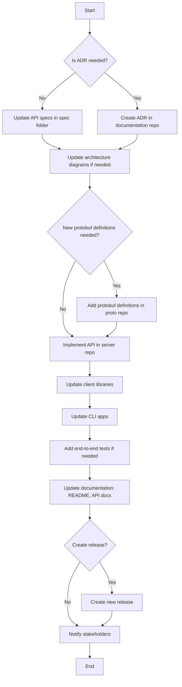

# Crypto Broker API Template

This document outlines the steps required to include a new API in the Crypto Broker server and its ecosystem.

1. **Determine ADR Requirement**: Assess whether an Architecture Decision Record (ADR) is needed for the new API. If required, create an ADR in the `crypto-broker-documentation` repository.
2. **Update Specifications**: If no ADR is needed, update the API specifications in the `spec` folder of the `crypto-broker-documentation` repository.
    - Review and update any relevant architecture diagrams as necessary.
3. **Add New Protobuf Definitions**: If the API requires new protobuf definitions, add them to the appropriate `.proto` files in the `crypto-broker-proto` repository.
4. **Implement API in Server**: Develop the new API in the `crypto-broker-server` repository.
5. **Update Client Libraries**: Implement or update the public-facing API in the client libraries (`crypto-broker-client-go`, `crypto-broker-client-js`).
6. **Update CLI Apps**: Update CLI apps (`crypto-broker-cli-go`, `crypto-broker-cli-js`) to support and test the new API.
7. **Add End-to-End Tests**: If needed, implement new end-to-end test cases in the `crypto-broker-deployment` repository to cover the new API.
8. **Update Documentation**: Revise documentation (README, API docs) to reflect the new API and its usage.
9. **Create Release**: If needed, create a new release for the updated repositories to include the new API.
10. **Notify Stakeholders**: Inform relevant stakeholders or users about the addition of the new API.

---

## Flowchart

