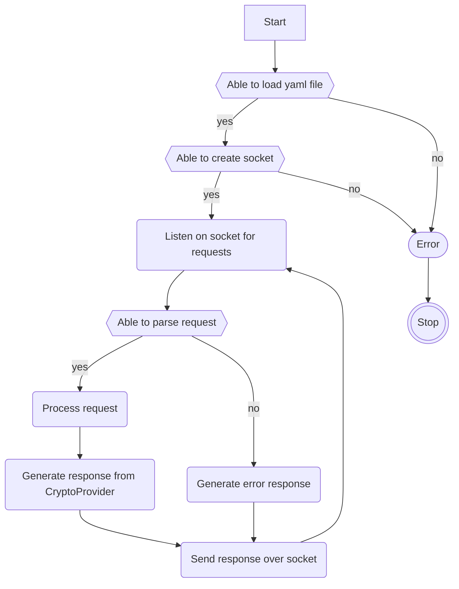

# Crypto Broker Activity Diagram

```mermaid
flowchart TD
    Start --> LYF
    LYF{{"Able to load yaml file"}}
    LYF --> |yes| CS
    LYF --> |no| Error
    CS{{"Able to create socket"}}
    CS --> |yes| LSR
    CS --> |no| Error
    LSR("Listen on socket for requests")
    LSR --> APR
    APR{{"Able to parse request"}}
    APR --> |yes| PR
    APR --> |no| ER
    PR("Process request")
    PR --> GR
    ER("Generate error response")
    ER --> SRS
    GR("Generate response from CryptoProvider")
    GR --> SRS
    SRS("Send response over socket")
    SRS --> LSR
    Error(["Error"])
    Error --> Stop
    Stop((("Stop")))
```
