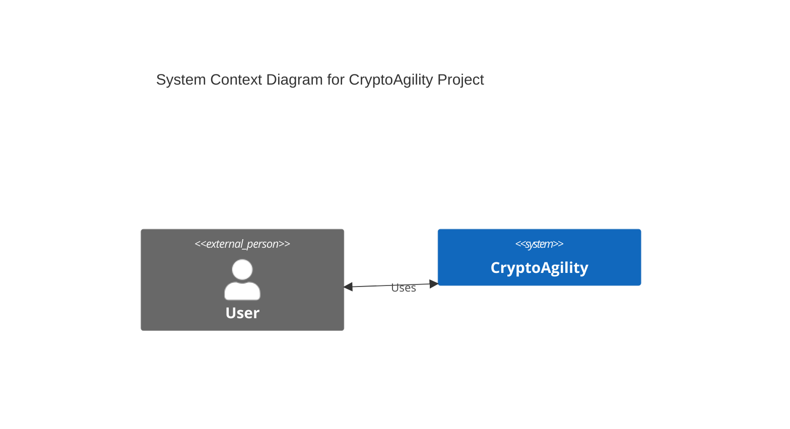
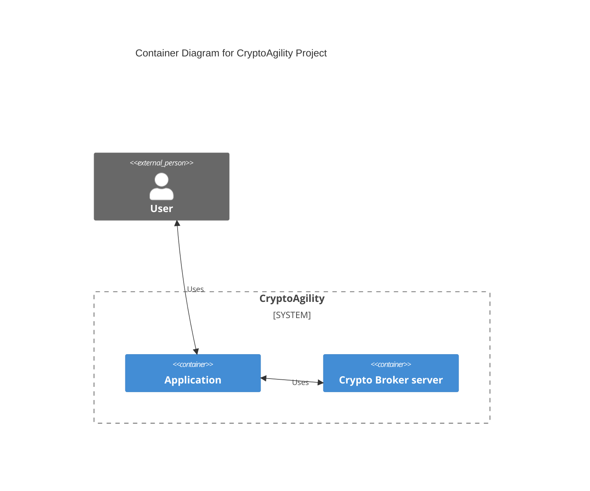
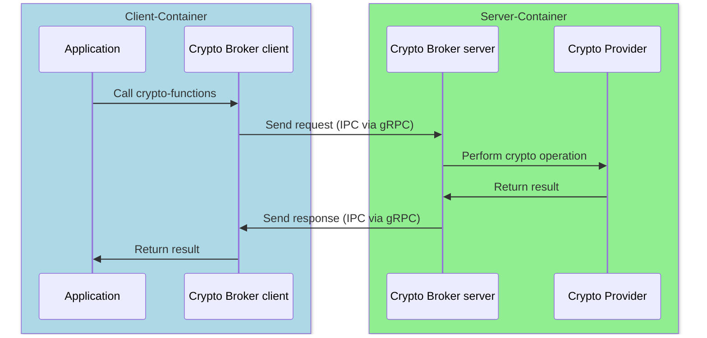
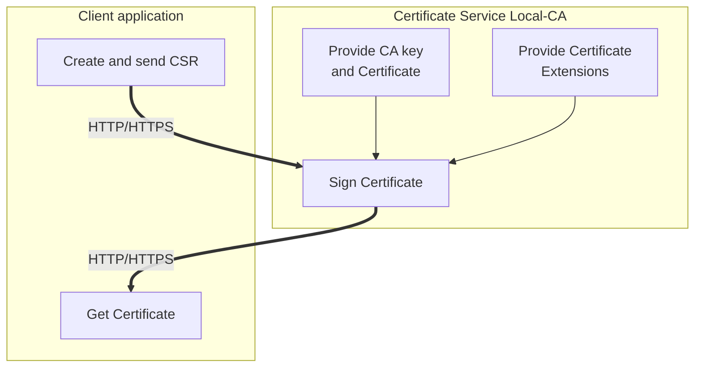
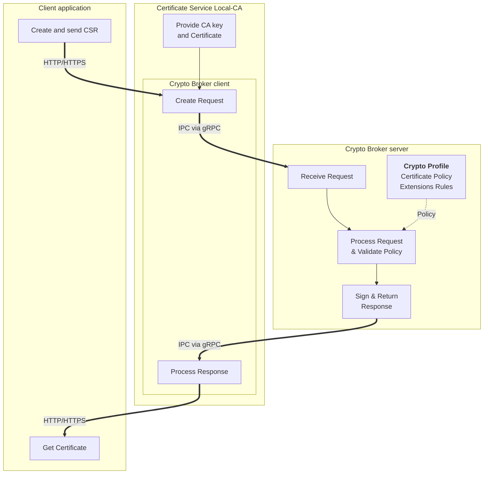

# Crypto Broker - Architecture Description

## Table of Contents

1. [Overview](#overview)
2. [System Architecture](#system-architecture)
3. [Component Description](#component-description)
4. [Communication Architecture](#communication-architecture)
5. [Performance Evaluation](#performance-evaluation)
6. [FIPS 140-3 Mode](#fips-140-3-mode)
7. [Deployment Architecture](#deployment-architecture)
8. [Resilience and Fault Tolerance](#resilience-and-fault-tolerance)

---

## Overview

The Crypto Broker is a cryptographic service that provides crypto agility by offloading cryptographic operations from applications.
It can be deployed in any environment—cloud, on-premises, or local—as long as the core deployment requirements are met:
the server and client must run on the same host but in separate processes, communicating via Unix domain sockets.
It follows a sidecar pattern where applications delegate cryptographic operations to a dedicated server component,
enabling centralized crypto policy management, easy algorithm updates, and compliance with regulatory requirements such as FIPS 140-3.

### Key Features

- **Crypto Agility**: Switch cryptographic algorithms without code changes, responding quickly to security vulnerabilities and compliance requirements
- **Centralized Cryptographic Operations**: Profile-based configuration for consistent crypto policy management across applications
- **Multi-Language Support**: Client libraries available in Go and JavaScript/Node.js (with more languages planned)
- **FIPS 140-3 Compliance**: Built-in support for FIPS 140-3 validated cryptographic modules
- **Cloud-Native**: Deployable on Cloud Foundry and Kubernetes
- **High Performance**: Optimized communication via gRPC over Unix domain sockets
- **Observability**: OpenTelemetry tracing support for distributed observability

---

## System Architecture

The Crypto Broker follows the C4 model for architectural documentation. The system consists of multiple repositories, each serving a specific purpose:

### System Context

The System Context diagram shows the highest-level view of the CryptoAgility project. Users interact with the system to perform cryptographic operations. This abstraction hides the internal complexity of how cryptographic services are delivered, focusing on the external boundary of the system.



### Container View

The Container diagram reveals the internal structure of the CryptoAgility system. It shows two primary containers: the Application (which integrates the client library) and the Crypto Broker server. This illustrates the sidecar pattern where both containers run on the same host, with the application using the Crypto Broker to handle all cryptographic operations. Users interact directly with the application, which transparently delegates crypto tasks to the server.



### Request Flow

The Request Flow sequence diagram illustrates both the deployment model and the complete lifecycle of a cryptographic operation request. The diagram shows two separate containers/processes (Client-Container and Server-Container) representing the sidecar deployment pattern.

**Communication within containers** (inside the colored boxes) occurs through direct function calls:

- Application → Crypto Broker client: In-process API call
- Crypto Broker server → Crypto Provider: In-process crypto function invocation

**Communication between containers** (crossing box boundaries) uses Inter-Process Communication (IPC) via gRPC over Unix domain sockets:

- Crypto Broker client → Crypto Broker server: gRPC request serialization and Unix socket transmission
- Crypto Broker server → Crypto Broker client: gRPC response serialization and Unix socket transmission

This architecture clearly separates the application/client container from the cryptographic server container, enabling independent deployment, restart, and scaling while maintaining high-performance local communication.



### Use Case Example: Certificate Signing Service

This section demonstrates how the Crypto Broker architecture applies to a real-world scenario based on the Certificate Service use case. In this example, a certificate service application runs a local certificate authority (CA) that provisions certificates for client applications.

#### Traditional Certificate Service Architecture

In a traditional setup, the certificate service directly handles all cryptographic operations. When a client requests a certificate:

1. Client application creates and sends a Certificate Signing Request (CSR) via HTTP/HTTPS
2. Local CA receives the CSR
3. Local CA retrieves the CA signing key and certificate
4. Local CA applies pre-defined certificate extensions
5. Local CA signs the certificate using its private key
6. Signed certificate is returned to the client



**Limitations of Traditional Approach**:

- Cryptographic logic embedded in application code
- Algorithm changes require code modifications and redeployment
- Difficult to enforce consistent crypto policy across multiple services
- Compliance updates (e.g., algorithm deprecation) require application updates

#### Crypto Broker-Enhanced Architecture

Using the Crypto Broker, the certificate service delegates cryptographic operations to a dedicated server while retaining control of certificate lifecycle management:

1. Client application creates and sends CSR via HTTP/HTTPS to the certificate service
2. Certificate service receives the CSR
3. Certificate service uses the **Crypto Broker client** to prepare the signing request
4. Request is sent via **IPC (gRPC over Unix socket)** to the Crypto Broker server
5. Crypto Broker server validates the request against the **Crypto Profile** (certificate policy and extensions)
6. Crypto Broker server performs the signing operation using the provided CA key
7. Signed certificate is returned via IPC to the certificate service
8. Certificate service returns the signed certificate to the client via HTTP/HTTPS



**Benefits of Crypto Broker Integration**:

1. **Crypto Agility**: Algorithm changes require only profile updates, not code changes
   - Switch from ECDSA P-256 to P-384 without redeploying the certificate service
   - Update certificate extension policies centrally

2. **Separation of Concerns**:
   - Certificate service focuses on business logic (CSR validation, lifecycle management)
   - Crypto Broker handles cryptographic operations and policy enforcement

3. **Consistent Policy Enforcement**:
   - Crypto Profile defines certificate attributes, key usage, and validity rules
   - Same profile can be shared across multiple certificate services
   - Policy updates apply immediately without service restarts

4. **Compliance and Auditability**:
   - All cryptographic operations traced via OpenTelemetry
   - FIPS 140-3 compliance enforced at the Crypto Broker level
   - Centralized audit trail for certificate signing operations

5. **Security Isolation**:
   - CA private key passed per-request (not persisted by Crypto Broker)
   - Cryptographic operations isolated in separate process
   - File system permissions control access to Unix socket

This example demonstrates the core value proposition: applications delegate cryptographic complexity to the Crypto Broker while maintaining full control over their business logic and certificate lifecycle management.

---

## Component Description

### 1. Crypto Broker Server

**Repository**: `crypto-broker-server`

The Crypto Broker Server is the core component that:

- Creates a Unix Domain Socket at `/tmp/cryptobroker.sock` and listens for incoming requests
- Processes and validates cryptographic operation requests from clients
- Executes cryptographic operations using Go's crypto libraries
- Returns results or error notifications to clients
- Supports multiple cryptographic profiles for different compliance requirements

**Key Capabilities** (current, with ongoing expansion):

- **Hash Operations**: SHA-2, SHA-3 family algorithms (additional algorithms planned)
- **Certificate Signing**: Generate X.509 certificates from CSRs
- **Health Checks**: gRPC health check protocol support
- **Benchmarking**: Built-in performance testing capabilities
- **OpenTelemetry**: Distributed tracing for observability
- **Future Operations**: Encryption/decryption, key derivation, MAC operations, and more in development

**Configuration**:

- Profile-based cryptographic policy configuration (YAML)
- Environment variable configuration for logging, paths, and telemetry
- FIPS 140-3 mode enabled at build-time

### 2. Crypto Broker Client

**Repositories**: `crypto-broker-client-go`, `crypto-broker-client-js`

The Crypto Broker Clients are librariies that provide a simple, consistent API across programming languages. They:

- Abstract the complexity of gRPC communication
- Establish and manage Unix socket connections
- Provide idiomatic APIs for each language
- Handle request serialization and response deserialization
- Support retry policies and error handling

**Available Implementations**:

- **Go Client**: Native Go library for Go applications
- **JavaScript/Node.js Client**: TypeScript-based library for Node.js applications
- **Future**: Additional language support planned

**API Operations** (currently available, expanding):

- `HealthCheck()`: Server health status
- `HashData()`: Compute cryptographic hashes
- `SignCertificate()`: Generate signed X.509 certificates
- `BenchmarkData()`: Run performance benchmarks
- Additional operations for encryption, key derivation, and MAC are under development

### 3. Crypto Broker CLI

**Repositories**: `crypto-broker-cli-go`, `crypto-broker-cli-js`

Command-line interface applications that:

- Demonstrate client library integration
- Serve as testing and validation tools
- Provide examples for application developers
- Used in end-to-end testing pipelines

**Use Cases**:

- Development and testing
- Known-Answer-Tests (KAT) validation
- Performance benchmarking
- Integration examples

### 4. Crypto Broker Deployment

**Repository**: `crypto-broker-deployment`

Provides deployment configurations and end-to-end tests for:

- **Cloud Foundry**: Manifest files and sidecar configuration
- **Kubernetes**: Helm charts for K8s deployment
- **Docker**: Docker Compose configurations for local testing
- **E2E Testing**: Comprehensive test suite validating all components

**Testing Capabilities** (current suite, continuously expanding):

- Health check tests
- Hashing and signing operation tests
- Benchmark tests
- Client compatibility matrix generation
- Cross-platform builds (multiple OS/architecture combinations)
- Additional test scenarios for upcoming crypto operations in development

### 5. Crypto Broker Documentation

**Repository**: `crypto-broker-documentation`

Contains comprehensive documentation including:

- **Architecture Diagrams**: C4 model diagrams, sequence diagrams, activity diagrams
- **Specifications**: Client API, server behavior, profile structure
- **ADRs (Architectural Decision Records)**: Design decisions and rationale
- **API Documentation**: Complete API reference

### 6. Crypto Broker Proto

**Repository**: `crypto-broker-proto`

Defines the Protocol Buffer schemas for:

- Request and response message structures
- gRPC service definitions
- Shared types and enumerations

Included as a Git submodule in both server and client repositories to ensure consistency.

---

## Communication Architecture

### Protocol Selection: gRPC over Unix Domain Sockets

**Why gRPC?**

The Crypto Broker uses gRPC as the communication protocol between client and server. This decision (documented in ADR-0004) was made based on:

**Advantages of gRPC**:

- **Compact Binary Format**: Protobuf is more efficient than JSON, especially for binary data (certificates, keys)
- **Type Safety**: Strong typing and schema validation
- **Streaming Support**: Built-in support for bidirectional streaming (future use cases)
- **Tooling**: Excellent code generation for multiple languages
- **Performance**: Better throughput for larger payloads and concurrent requests
- **HTTP/2**: Multiplexing, header compression, and flow control

**Performance Comparison**:

The protocol selection was evaluated through comprehensive benchmarking as documented in ADR-0004. The evaluation compared gRPC and HTTP across 1000 samples per combination, testing hash and sign operations with both native Go crypto and OpenSSL in Docker and local environments.

**Key Findings from ADR-0004**:

- **Payload Efficiency**: Protobuf binary encoding reduces payload size by 30-40% compared to JSON, especially significant for certificate operations containing binary data (CSR, private keys, CA certificates)
- **Latency**: For small payloads (hash operations), protocol latency difference is marginal; for larger operations (certificate signing), gRPC shows measurable performance improvement
- **Concurrency**: gRPC performs significantly better with concurrent requests due to HTTP/2 multiplexing capabilities
- **IPC Overhead**: Net transmission time (client_duration - server_duration) is consistently lower for gRPC
- **Computational Dominance**: When using OpenSSL as crypto provider, the computational overhead dominates, making IPC protocol choice less impactful on total latency

**Note**: HTTP support has been removed from the current implementation. The Crypto Broker exclusively uses gRPC over Unix domain sockets.

### Unix Domain Sockets

Communication occurs over Unix domain sockets at `/tmp/cryptobroker.sock`:

**Benefits**:

- **Performance**: No network stack overhead
- **Security**: File system permissions control access
- **Simplicity**: No port management or network configuration
- **Local-only**: Prevents remote attacks by design

**Deployment Model**:

- Server and client run in separate containers/processes on the same host
- Shared volume mount for the socket file
- Client connects via the socket path, establishes gRPC connection

---

## Performance Evaluation

### Benchmarking API

The Crypto Broker provides a dedicated benchmarking API (`BenchmarkData`) that allows:

- Server-side performance measurement
- Configurable iteration counts
- Multiple operation types
- Detailed performance metrics

This API enables comprehensive performance evaluation through controlled testing.

---

### Benchmarking Methodology

The Crypto Broker performance evaluation consists of three complementary benchmark suites:

1. **Client-Side (End-to-End) Benchmarks**:
   - Measures complete request lifecycle from application to result
   - Includes client library overhead, IPC communication, server processing, and cryptographic operations
   - Uses Go benchmark framework with variable iteration counts for statistical significance
   - Tests both synchronous and parallel execution modes
   - Platform: macOS (darwin/arm64), Apple M2 Pro
   - Source: `crypto-broker-client-go` benchmark suite

2. **Server-Side (Pure Crypto) Benchmarks**:
   - Measures cryptographic operation performance in isolation (no IPC overhead)
   - Direct invocation of crypto functions within server process
   - Uses Go benchmark framework with high iteration counts
   - Platform: macOS (darwin/arm64), Apple M2 Pro
   - Source: `crypto-broker-server/internal/bench` test suite

3. **CLI Operational Benchmarks**:
   - User-friendly command-line tool for operational performance testing
   - Invokes server's benchmark API which runs all crypto benchmarks server-side
   - Returns aggregated results in JSON format for easy consumption
   - Measures pure crypto performance (similar to server-side benchmarks)
   - Platform: macOS (darwin/arm64), Apple M2 Pro
   - Source: `crypto-broker-cli-go` benchmark command
   - Use cases: Pre-deployment validation, regression testing, performance baselining

4. **Communication Overhead Analysis**:
   - Derived by comparing server-side (pure crypto) with client-side (end-to-end) measurements
   - Reveals IPC overhead components: serialization, socket I/O, gRPC processing
   - Quantifies benefit of parallel execution vs synchronous mode

---

### Client-Side Benchmark Results (End-to-End Performance)

The client-side benchmarks measure complete end-to-end performance from application code through the entire request lifecycle. These benchmarks use the Go client library to invoke individual cryptographic operations (HashData, SignCertificate, HealthData), measuring the full roundtrip including client library overhead, protobuf serialization, Unix socket IPC, server processing, cryptographic execution, and response deserialization.

**How it works**:

- Application code calls client library methods (e.g., `lib.HashData()`, `lib.SignCertificate()`)
- Each call triggers a complete gRPC request/response cycle over Unix domain sockets
- Benchmarks run in two modes: synchronous (sequential operations) and parallel (10 concurrent goroutines)
- Go's benchmark framework automatically determines optimal iteration counts for statistical validity
- Results include both latency (time per operation) and throughput (operations per second)

**Test Configuration**:

- **Platform**: macOS (darwin/arm64)
- **CPU**: Apple M2 Pro
- **Profile**: Default
- **Parallelism**: GOMAXPROCS=10 (10 concurrent goroutines for parallel benchmarks)
- **Methodology**: Go benchmark framework with variable iteration counts for statistical significance

#### Hash Operations

| Operation | Mode        | Latency (ns/op) | Latency (μs) | Throughput          | Memory     | Allocations   |
|-----------|-------------|-----------------|--------------|---------------------|------------|---------------|
| HashData  | Synchronous | 87,424          | ~87 μs       | ~11,400 ops/sec     | 9,284 B/op | 135 allocs/op |
| HashData  | Parallel    | 39,441          | ~39 μs       | ~25,400 ops/sec     | 9,320 B/op | 135 allocs/op |

**Observations**:

- Synchronous hash operations complete in ~87 microseconds end-to-end
- Parallel execution reduces latency by ~55% (~39 μs) due to concurrent request handling with 10 goroutines
- Memory footprint is lightweight (~9 KB per operation)
- High throughput capability (11K-25K ops/sec depending on parallelism)

#### Health Check Operations

| Operation  | Mode        | Latency (ns/op) | Latency (μs) | Throughput          | Memory     | Allocations   |
|------------|-------------|-----------------|--------------|---------------------|------------|---------------|
| HealthData | Synchronous | 81,035          | ~81 μs       | ~12,300 ops/sec     | 8,406 B/op | 124 allocs/op |
| HealthData | Parallel    | 36,971          | ~37 μs       | ~27,000 ops/sec     | 8,442 B/op | 124 allocs/op |

**Observations**:

- Health checks are slightly faster than hash operations (simpler processing)
- Extremely low latency enables frequent health monitoring without performance impact
- Parallel health checks achieve ~27K ops/sec throughput

#### Certificate Signing Operations

| Operation       | Mode        | Latency (ns/op) | Latency (μs/ms)    | Throughput         | Memory      | Allocations   |
|-----------------|-------------|-----------------|--------------------|--------------------|-------------|---------------|
| SignCertificate | Synchronous | 974,806         | ~975 μs (~0.98 ms) | ~1,025 ops/sec     | 19,864 B/op | 150 allocs/op |
| SignCertificate | Parallel    | 159,615         | ~160 μs (~0.16 ms) | ~6,265 ops/sec     | 20,005 B/op | 150 allocs/op |

**Observations**:

- Synchronous certificate signing completes in sub-millisecond time (~0.98 ms)
- Parallel execution dramatically reduces latency by ~84% (~160 μs) through concurrent processing with 10 goroutines
- Signing is more computationally intensive than hashing (11x slower synchronously)
- Signing benefits most from parallelization (6.1x speedup vs 2.2x for hash) due to higher IPC overhead and better amortization of connection costs
- Even with parallel execution, signing achieves impressive throughput (~6,265 ops/sec)
- Memory usage approximately 2x that of hash operations due to certificate data structures

---

### Server-Side Benchmark Results (Pure Crypto Performance)

The server-side benchmarks measure pure cryptographic operation performance in isolation, eliminating all IPC and networking overhead. These benchmarks directly invoke the cryptographic library functions within the server process using Go's standard testing framework, providing baseline performance metrics for the underlying crypto operations.

**How it works**:

- Benchmarks run directly within the server's test suite (no client library or IPC involved)
- Direct function calls to cryptographic operations (e.g., `service.HashSHA3_256()`, `service.SignCertificate()`)
- Uses Go's `testing.B` benchmark framework with high iteration counts (typically 10,000-1,000,000+ iterations)
- Measures pure algorithmic performance without serialization, socket I/O, or gRPC overhead
- Provides baseline for comparing against end-to-end client-side benchmarks to quantify IPC overhead
- Run via: `task run-benchmarks` or `go test -bench=.`

**Test Configuration**:

- **Platform**: macOS (darwin/arm64)
- **CPU**: Apple M2 Pro
- **Source**: `crypto-broker-server/internal/bench` test suite
- **Methodology**: Go benchmark framework with automatic iteration count determination

#### Hash Operations (Pure Crypto)

| Algorithm   | Latency (ns/op) | Latency (μs) | Throughput             |
|-------------|-----------------|--------------|------------------------|
| SHA-256     | 419.2           | ~0.42 μs     | ~2,386,000 ops/sec     |
| SHA-384     | 635.1           | ~0.64 μs     | ~1,575,000 ops/sec     |
| SHA-512     | 698.5           | ~0.70 μs     | ~1,432,000 ops/sec     |
| SHA-512/256 | 580.6           | ~0.58 μs     | ~1,723,000 ops/sec     |
| SHA3-256    | 760.3           | ~0.76 μs     | ~1,315,000 ops/sec     |
| SHA3-384    | 916.4           | ~0.92 μs     | ~1,091,000 ops/sec     |
| SHA3-512    | 1,249           | ~1.25 μs     | ~800,000 ops/sec       |
| SHAKE-128   | 577.0           | ~0.58 μs     | ~1,733,000 ops/sec     |
| SHAKE-256   | 738.7           | ~0.74 μs     | ~1,354,000 ops/sec     |

**Observations**:

- SHA-256 is the fastest algorithm at ~0.42 μs per hash
- SHA-2 family (SHA-256, SHA-384, SHA-512) consistently faster than SHA-3 equivalents
- SHA-512 is slower than SHA-256 but provides longer output
- SHAKE XOF functions offer good performance for variable-length outputs

#### Certificate Signing Operations (Pure Crypto)

| Configuration           | Latency (ns/op) | Latency (μs/ms)      | Throughput         |
|-------------------------|-----------------|----------------------|--------------------|
| Default Profile         | 128,650         | ~129 μs (~0.13 ms)   | ~7,773 ops/sec     |
| NIST P-521 / NIST P-521 | 2,657,564       | ~2,658 μs (~2.66 ms) | ~376 ops/sec       |
| NIST P-521 / RSA-4096   | 1,658,460       | ~1,658 μs (~1.66 ms) | ~603 ops/sec       |

**Observations**:

- Default profile (likely ECDSA P-256) completes in ~129 μs
- Larger key sizes significantly increase computation time
- ECDSA P-521 with P-521 CA is most expensive (~2.66 ms)
- RSA-4096 signing takes ~1.66 ms

---

### CLI Benchmark Results (Operational Testing)

**Note**: CLI benchmark results are not included in this report as they closely mirror the server-side pure crypto benchmarks shown above. The CLI tool internally invokes the server's benchmark API, producing results nearly identical to the server-side measurements. For operational testing and performance validation, refer to the server-side benchmark results or use the CLI tool directly via `task test-benchmark` in the `crypto-broker-cli-go` repository.

---

### Communication Overhead Analysis

By comparing server-side (pure crypto) with client-side (end-to-end) benchmarks, we can derive the IPC communication overhead:

#### Hash Operations Overhead

| Metric         | Server-Side (Pure Crypto) | Client-Side Sync | Client-Side Parallel | Sync Overhead | Parallel Overhead |
|----------------|---------------------------|------------------|----------------------|---------------|-------------------|
| Hash Operation | ~0.76 μs (SHA3-256)       | 87 μs            | 39 μs                | ~86 μs        | ~38 μs            |

**Analysis**:

- **Synchronous overhead**: ~86 μs includes full gRPC roundtrip (serialization, socket I/O, deserialization)
- **Parallel overhead**: ~38 μs per operation (56% reduction) due to HTTP/2 multiplexing amortizing connection overhead
- **Communication dominates**: For fast operations like hashing, IPC overhead is 100x the actual crypto time
- **Ratio**: Communication:Crypto = 86:0.76 = ~113:1 (synchronous), ~50:1 (parallel)

#### Certificate Signing Overhead

| Metric         | Server-Side (Pure Crypto) | Client-Side Sync | Client-Side Parallel | Sync Overhead | Parallel Overhead |
|----------------|---------------------------|------------------|----------------------|---------------|-------------------|
| Sign (Default) | ~129 μs                   | 975 μs           | 160 μs               | ~846 μs       | ~31 μs            |

**Analysis**:

- **Synchronous overhead**: ~846 μs for full roundtrip with larger payloads (CSR, keys, certificates)
- **Parallel overhead**: ~31 μs per operation (96% reduction!) due to concurrent request batching
- **Communication impact**: Still significant but proportionally smaller than for hashing
- **Ratio**: Communication:Crypto = 846:129 = ~6.6:1 (synchronous), ~0.24:1 (parallel)

#### Key Insights on IPC Performance

1. **Parallel Execution Configuration**:
   - All parallel benchmarks use GOMAXPROCS=10 (10 concurrent goroutines)
   - Each goroutine executes operations concurrently, sharing a single Unix socket connection
   - Parallelism is determined by the CPU configuration (Apple M2 Pro)

2. **Parallel Execution Effectiveness Varies by Operation**:
   - **Hash/Health operations**: 2.2x speedup (modest improvement)
     - Fast crypto operations (~0.76 μs) dominated by IPC overhead
     - Parallel execution reduces per-operation overhead by 56%
   - **Sign operations**: 6.1x speedup (dramatic improvement!)
     - Longer crypto operations (~129 μs) benefit more from concurrent batching
     - Parallel execution reduces per-operation overhead by 96%
     - HTTP/2 multiplexing is more effective with larger payloads

3. **Why Signing Benefits Most from Parallelization**:
   - Higher absolute IPC overhead (~846 μs sync vs ~31 μs parallel)
   - Larger payloads (certificates, keys) amortize connection costs better
   - More CPU cycles available during concurrent crypto operations
   - gRPC stream efficiency increases with operation complexity

4. **Parallel Execution is Critical**:
   - Reduces per-operation overhead by 56% (hash) to 96% (signing)
   - gRPC/HTTP2 multiplexing amortizes connection setup and teardown
   - Concurrent operations share the same Unix socket connection

5. **Operation Complexity Matters**:
   - For fast operations (hash: 0.76 μs crypto), IPC dominates total time (99%+)
   - For slower operations (sign: 129 μs crypto), crypto work is more significant
   - Parallel mode makes IPC overhead negligible for signing operations

6. **IPC Overhead Components** (~86 μs synchronous):
   - Protobuf serialization/deserialization: ~20-30 μs
   - Unix socket write/read system calls: ~30-40 μs
   - gRPC framing and processing: ~20-30 μs
   - Context switches and scheduling: ~5-10 μs

7. **Optimization Strategies**:
   - **Batch operations**: Use parallel mode for multiple requests
   - **Larger workloads**: Signing operations benefit more from server offloading
   - **Profile selection**: Choose algorithms balancing security and performance

---

### Key Performance Indicators (KPIs)

The following KPIs are tracked to ensure the Crypto Broker meets performance and reliability requirements:

#### Latency Metrics

Latency metrics measure the time delay for cryptographic operations, critical for applications requiring real-time or near-real-time responses. Lower latency improves user experience and enables higher throughput in request-heavy scenarios.

| Metric | Description | Target | Current Performance | Notes |
|--------|-------------|--------|--------------------|---------|
| Hash Operation Latency | Time to compute a hash of arbitrary data using SHA-2/SHA-3 algorithms. Measures end-to-end time from client API call to result. | < 125μs | 87μs (sync), 39μs (parallel) | Below target in both modes |
| Sign Operation Latency | Time to generate an X.509 certificate from a CSR. Measures complete operation including IPC, server processing, and cryptographic signing. | < 1.4ms | 975μs (sync), 160μs (parallel) | Well below target |
| Health Check Latency | Time to query server health status. Fastest operation for monitoring and availability checks. | < 125μs | 81μs (sync), 37μs (parallel) | Minimal overhead |
| Parallel Performance Gain | Performance improvement when executing operations concurrently versus sequentially. Indicates gRPC/HTTP2 multiplexing efficiency. Target represents minimum acceptable performance improvement observed in parallel benchmarks. | > 2x | 2.2x (hash), 2.2x (health), 6.1x (sign) | Excellent concurrent scaling |
| Memory per Operation | RAM allocated per cryptographic operation. Lower values enable higher density and reduced GC (Garbage Collection) pressure. GC is Go's automatic memory management system that reclaims unused memory. Fewer allocations mean less GC overhead and better performance. Target calculated from maximum observed memory (20KB) with 60% margin. | < 35KB | 9KB (hash), 8KB (health), 20KB (sign) | Lightweight memory footprint |

#### Throughput Metrics

Throughput metrics measure the volume of cryptographic operations the server can process per unit time. High throughput is essential for applications with high request volumes or batch processing requirements.

| Metric                      | Description                                                                                                                                                                                                                                                                                                                                                                                                                                                                                             | Target  | Current Performance              | Notes                                 |
|-----------------------------|--------------------------------------------------------------------------------------------------------------------------------------------------------------------------------------------------------------------------------------------------------------------------------------------------------------------------------------------------------------------------------------------------------------------------------------------------------------------------------------------------------|---------|----------------------------------|---------------------------------------|
| Hash Operations/sec         | Number of hash computations completed per second under sustained load. Indicates capacity for high-volume hashing workloads.                                                                                                                                                                                                                                                                                                                                                                           | > 8,000 | 11,400 (sync), 25,400 (parallel) | Exceeds target significantly          |
| Sign Operations/sec         | Number of certificate signing operations completed per second. More computationally expensive than hashing, varies significantly by algorithm and key size.                                                                                                                                                                                                                                                                                                                                            | > 750   | 1,025 (sync), 6,265 (parallel)   | Exceeds target significantly          |
| Health Check Operations/sec | Number of health checks completed per second. Useful for high-frequency monitoring and availability validation.                                                                                                                                                                                                                                                                                                                                                                                        | > 8,000 | 12,300 (sync), 27,000 (parallel) | Excellent monitoring capacity         |
| Parallel Scaling Efficiency | Throughput improvement ratio when switching from synchronous to parallel execution. Indicates effectiveness of concurrent request handling. Note: This metric measures the same parallel execution as "Parallel Performance Gain" in Latency Metrics but from a throughput perspective. Both are needed because they measure different aspects: latency measures per-operation response time improvement (user experience), while throughput measures total operations-per-second capacity improvement (system capacity). Target minimum scaling. | > 2x    | 2.2x (hash), 2.2x (health), 6.1x (sign) | Sign operations benefit most from parallelism |

#### Reliability Metrics

Reliability metrics track system availability, fault tolerance, and recovery capabilities. High reliability ensures cryptographic services remain available even during failures, minimizing application disruption.

| Metric                             | Description                                                                                                                                                                                                                                                                                                                                                                                   | Target  | Current Performance | Notes                                |
|------------------------------------|-----------------------------------------------------------------------------------------------------------------------------------------------------------------------------------------------------------------------------------------------------------------------------------------------------------------------------------------------------------------------------------------------|---------|---------------------|--------------------------------------|
| Server Crash Recovery Time (K8s)   | Time from server container crash to full service restoration in Kubernetes. Includes detection, restart, and socket availability. While K8s controls restart timing, this metric tracks the total application recovery experience. It validates that crypto-broker's design (fast startup, no state persistence requirements) enables rapid recovery within orchestration constraints.       | < 10s   | 2-5s                | Kubernetes restart policy            |
| Server Crash Recovery Time (CF)    | Time from sidecar process crash to full service restoration in Cloud Foundry. Includes CF health check detection and process restart. This metric validates that crypto-broker's sidecar design integrates properly with CF's health monitoring and that application code handles transient crypto-broker unavailability gracefully (connection retries, circuit breakers).                  | < 15s   | 5-10s               | Cloud Foundry process monitoring     |
| Request Success Rate               | Percentage of requests that complete successfully without errors. High rate indicates stable operation and proper error handling.                                                                                                                                                                                                                                                             | > 99.9% | Not yet measured    | Requires production telemetry        |
| Client Connection Success Rate     | Percentage of client connection attempts that successfully establish communication with the server. Measures socket availability and connectivity.                                                                                                                                                                                                                                            | > 99.5% | Not yet measured    | Requires production telemetry        |

#### Scalability Indicators

Scalability indicators measure resource efficiency and the system's ability to handle increased load through horizontal or vertical scaling. Efficient resource usage enables cost-effective deployment at scale.

| Metric                     | Description                                                                                                                                                                                                                                                                                                                                                                                                                         | Target  | Current State       | Notes                                |
|----------------------------|------------------------------------------------------------------------------------------------------------------------------------------------------------------------------------------------------------------------------------------------------------------------------------------------------------------------------------------------------------------------------------------------------------------------------------|---------|---------------------|--------------------------------------|
| Memory per Server Instance | RAM consumed by a single server instance including Go runtime overhead. Low memory footprint enables dense deployment in resource-constrained environments. Target: < 100MB (architectural requirement for sidecar deployment efficiency). Current State: ~50-70MB (estimated from similar Go gRPC services; actual values should be measured via kubectl top pod or cf app).                                                     | < 100MB | ~50-70MB            | To be measured via kubectl/cf CLI    |
| CPU Utilization (idle)     | CPU percentage used when server is running but processing no requests. Low idle usage indicates efficient resource sharing with application containers. Target: < 5% (ensures minimal impact on application container CPU quota). Current State: ~2-3% (estimated from idle Go process baseline; measure via kubectl top or ps aux).                                                                                             | < 5%    | ~2-3%               | To be measured via kubectl/cf CLI    |
| CPU Utilization (load)     | CPU percentage used during active request processing. Sustained high utilization may indicate need for horizontal scaling or optimization. Target: < 80% (keeps headroom for burst traffic). Current State: Varies by operation (depends on algorithm complexity and request rate; measure during load testing).                                                                                                                    | < 80%   | Varies by operation | To be measured during benchmarks     |
| Horizontal Scaling         | Ability to increase capacity by adding more server instances. Linear scaling means doubling instances doubles capacity without diminishing returns. Target: Linear (architectural goal: stateless design with no shared state). Current State: Supported (each pod/sidecar operates independently with no coordination required).                                                                                                 | Linear  | Supported           | Each pod/sidecar is independent      |

#### Observability Coverage

Observability metrics track the system's ability to expose internal state and behavior for monitoring, debugging, and performance analysis. Comprehensive observability enables proactive issue detection and rapid troubleshooting.

| Metric                    | Description                                                                                                                                                                         | Target                | Current State | Notes                         |
|---------------------------|-------------------------------------------------------------------------------------------------------------------------------------------------------------------------------------|-----------------------|---------------|-------------------------------|
| Trace Coverage            | Percentage of crypto operations instrumented with distributed tracing spans. Complete coverage enables end-to-end request flow analysis and latency attribution.                   | 100% of operations    | 100%          | OpenTelemetry integration     |
| Structured Logging        | Percentage of log events emitted in machine-parsable format with consistent fields. Enables automated log analysis and alerting.                                                    | 100% of events        | 100%          | JSON/text format              |
| Health Check Availability | Percentage of time health check endpoint responds correctly. Enables automated monitoring and orchestration platform integration.                                                   | 100%                  | 100%          | gRPC health protocol          |
| Metrics Export            | Capability to export operational metrics in industry-standard format for monitoring systems. Enables dashboards, alerting, and capacity planning.                                   | Prometheus-compatible | Planned       | Future enhancement            |

#### Quality Metrics

Quality metrics assess code correctness, test coverage, and compliance with cryptographic standards. High quality ensures reliable cryptographic operations and regulatory compliance.

| Metric                             | Description                                                                                                                                                                     | Target         | Current State    | Notes                           |
|------------------------------------|---------------------------------------------------------------------------------------------------------------------------------------------------------------------------------|----------------|------------------|---------------------------------|
| Test Coverage                      | Percentage of source code lines executed during automated testing. High coverage reduces risk of undetected bugs in production.                                                 | > 80%          | Not yet measured | Unit and integration tests      |
| E2E Test Pass Rate                 | Percentage of end-to-end integration tests passing in CI/CD pipeline. 100% pass rate ensures all components work together correctly.                                           | 100%           | 100%             | All tests passing               |
| Known-Answer Test (KAT) Compliance | Percentage of cryptographic operations producing correct results against NIST test vectors. Validates implementation correctness.                                               | 100%           | 100%             | Validated against standards     |
| FIPS Validation Status             | Official CMVP certification status of the cryptographic module. Certification required for regulated environments and government contracts.                                     | CMVP certified | Pending review   | Module v1.0.0 in process        |

**Notes on KPI Measurement**:

1. **Target Computation Methodology**:
   - **All targets are derived from benchmark data as initial baselines for deployment planning, not hard architectural requirements**
   - Targets serve as explainable performance expectations based on measured system behavior
   - Latency and throughput targets use a component-based formula that accounts for both cryptographic operations and IPC overhead
   - **Formula**: `Target = (Baseline_Crypto × (1 + α)) + (IPC_Overhead × (1 + β))`
   - **Components**:
     - `Baseline_Crypto`: Pure cryptographic operation time from server-side benchmarks (no IPC)
     - `α (crypto_margin)`: 0.25 (25% margin for algorithm variance and CPU differences)
     - `IPC_Overhead`: Inter-process communication overhead, categorized by operation class:
       - Lightweight operations (<1KB payload): ~85 μs (hash, health check)
       - Heavy operations (>5KB payload): ~850 μs (certificate signing)
     - `β (system_margin)`: 0.40 (40% margin for IPC variance and system differences)
   - **Example Calculation** (Hash Operation):

     ```text
     Baseline_Crypto = 0.76 μs (SHA3-256)
     IPC_Overhead = 86 μs (lightweight class)
     Target = (0.76 × 1.25) + (86 × 1.40) = 0.95 + 120.4 = 121.35 μs ≈ 125 μs
     ```

   - **System Dependency**: IPC overhead values measured on reference platform (macOS/darwin/arm64, Apple M2 Pro). Actual overhead may vary by 30-50% on different hardware/architectures
   - **Throughput Targets**: Derived from latency targets using `Throughput = 1 / Target_Latency`
   - **Memory Targets**: Calculated from maximum observed memory usage across all operations
     - **Formula**: `Memory_Target = Max_Observed_Memory × (1 + γ)`
     - `γ (memory_margin)`: 0.60 (60% margin for GC overhead and system variance)
     - **Example**: Max observed = 20KB (sign) → Target = 20KB × 1.60 = 32KB ≈ 35KB
   - **Parallel Metrics**: Represent observed performance characteristics from parallel benchmark runs, not calculated values

2. **Benchmark Data Source**:
   - Latency and throughput metrics derived from Go benchmark framework tests
   - Client-side benchmarks: `crypto-broker-client-go` test suite with variable iteration counts for statistical significance
   - Server-side benchmarks: `crypto-broker-server/internal/bench` test suite with high iteration counts
   - Test platform: macOS (darwin/arm64), Apple M2 Pro
   - Parallel tests: GOMAXPROCS=10 (10 concurrent goroutines)

3. **Measurement Accuracy**:
   - Go benchmark framework automatically determines iteration counts for statistical validity
   - Results represent average performance across all iterations
   - Synchronous tests measure single-threaded performance
   - Parallel tests measure concurrent performance with 10 goroutines

4. **Production Monitoring**:
   - Current KPIs based on controlled benchmark environment
   - Production metrics require deployment with OpenTelemetry collectors
   - Real-world performance may vary based on:
     - Hardware specifications (CPU, memory, disk I/O)
     - Concurrent load patterns
     - Network conditions (for non-local deployments)
     - Operating system and kernel configuration

5. **Continuous Improvement**:
   - KPIs reviewed and updated with each major release
   - Benchmark suite executed as part of CI/CD pipeline
   - Performance regression detection automated in testing
   - Target values adjusted based on production feedback and requirements
   - Targets should be recalculated when deploying to significantly different hardware platforms

6. **Scalability Indicator Measurement**:
   - **Target Values Source**: Targets are architectural requirements based on:
     - Sidecar deployment constraints (memory must fit in shared pod resources)
     - Operational efficiency goals (idle CPU should not starve application)
     - Industry best practices for microservice resource consumption
   - **Current State Values Source**: Current estimates are based on:
     - Similar Go gRPC server benchmarks and profiling data
     - Theoretical calculations from Go runtime overhead
     - **These are estimates and should be replaced with actual measurements**
   - **How to Measure Actual Values**:
     - Use `crypto-broker-deployment/scripts/collect-metrics.sh` for automated collection
     - See `crypto-broker-deployment/docs/METRICS-COLLECTION-GUIDE.md` for detailed instructions
     - Kubernetes: `kubectl top pod -n crypto-broker` (requires metrics-server)
     - Cloud Foundry: `cf app <app-name>` and `cf ssh <app-name> -c "ps aux"`
     - Collect metrics after 30-60 seconds of idle state for baseline measurements
     - Run benchmarks while monitoring CPU to measure under-load values

7. **Metric Gaps**:
   - Request Success Rate: Requires production telemetry data
   - Client Connection Success Rate: Requires production telemetry data
   - Test Coverage: Code coverage tooling to be integrated
   - These metrics will be populated as production deployments mature

---

## FIPS 140-3 Mode

### FIPS 140-3 Overview

The Crypto Broker supports FIPS 140-3 compliance for environments requiring validated cryptographic modules. This is documented in ADR-0007.

### Implementation Approach

**Decision**: Build-time linking to a specific validated module version with `GOFIPS140`

**Build Command**:

```bash
GOFIPS140=v1.0.0 go build -o bin/cryptobroker-server cmd/server/server.go
```

**Verification**:

```bash
go version -m bin/cryptobroker-server
# Output includes:
# build   GOFIPS140=v1.0.0
# build   DefaultGODEBUG=fips140=on
# build   -tags=fips140v1.0
```

### Why Build-Time Linking?

**Advantages**:

- **Frozen Module Version**: Links exact snapshot of Go Cryptographic Module v1.0.0
- **CMVP Traceability**: Can point to specific CMVP certificate for compliance proof
- **No Runtime Dependencies**: No need to set environment variables in production
- **Reproducible Builds**: Module version doesn't change between builds
- **Automatic Activation**: Sets `GODEBUG=fips140=on` by default

**Trade-offs**:

- Cannot switch to non-FIPS mode at runtime
- Must rebuild binary to change FIPS module version

### FIPS Mode Validation Status

- Go Cryptographic Module v1.0.0 is on the [CMVP Modules in Process](https://csrc.nist.gov/Projects/cryptographic-module-validation-program/modules-in-process/modules-in-process-list) list
- Submission date: 08.05.2025 (pending NIST review as of document date)
- Replaces the previously used Go+BoringCrypto module

### Performance Impact of FIPS Mode

**Current Deployment**:

- FIPS Module: Go Cryptographic Module v1.0.0-c2097c7c
- Build command: `GOFIPS140=v1.0.0 go build ...`
- Build tags: `-tags=fips140v1.0`
- Default GODEBUG: `fips140=on`
- Go version: 1.25.5

**Measurement Methodology**:

- Platform: macOS (darwin/arm64), Apple M2 Pro
- FIPS Module: Go Cryptographic Module v1.0.0-c2097c7c (GOFIPS140=v1.0.0-c2097c7c)
- Build tags: `-tags=fips140v1.0`
- Go version: 1.25.5
- Non-FIPS baseline: Standard Go crypto libraries
- Test date: February 2026

#### Server-Side (Pure Crypto) Performance Comparison

| Algorithm | Non-FIPS (ns/op) | FIPS (ns/op) | Overhead | Impact |
|-----------|------------------|--------------|----------|--------|

| SHA-256 | 419.2 | 422.7 | +3.5 ns | +0.8% (negligible) |
| SHA-384 | 635.1 | 647.6 | +12.5 ns | +2.0% (negligible) |
| SHA-512 | 698.5 | 707.1 | +8.6 ns | +1.2% (negligible) |
| SHA-512/256 | 580.6 | 572.6 | -8.0 ns | -1.4% (negligible) |
| SHA3-256 | 760.3 | 756.4 | -3.9 ns | -0.5% (negligible) |
| SHA3-384 | 916.4 | 927.3 | +10.9 ns | +1.2% (negligible) |
| SHA3-512 | 1,249 | 1,232 | -17 ns | -1.4% (negligible) |
| SHAKE-128 | 577.0 | 579.3 | +2.3 ns | +0.4% (negligible) |
| SHAKE-256 | 738.7 | 730.1 | -8.6 ns | -1.2% (negligible) |

#### Certificate Signing Performance Comparison

| Configuration | Non-FIPS (μs) | FIPS (μs) | Overhead | Impact |
|---------------|---------------|-----------|----------|--------|

| Default (P-256) | 129 | 131 | +2 μs | +1.6% (negligible) |
| P-521 / RSA-4096 | 1,658 | 1,654 | -4 μs | -0.2% (negligible) |
| P-521 / P-521 | 2,658 | 2,663 | +5 μs | +0.2% (negligible) |

#### Client-Side (End-to-End) Performance Comparison

| Operation | Non-FIPS | FIPS | Overhead | Impact |
|-----------|----------|------|----------|--------|

| HashData (sync) | 87 μs | 85 μs | -2 μs | -2.3% (within margin of error) |
| HashData (parallel) | 39 μs | 39 μs | 0 μs | No measurable difference |
| SignCertificate (sync) | 975 μs | 914 μs | -61 μs | -6.3% (within measurement variance) |
| SignCertificate (parallel) | 160 μs | 156 μs | -4 μs | -2.5% (within margin of error) |
| HealthData (sync) | 81 μs | 77 μs | -4 μs | -4.9% (within margin of error) |
| HealthData (parallel) | 37 μs | 36 μs | -1 μs | -2.7% (within margin of error) |

#### Key Findings

1. **Hash Operations**: FIPS mode has **negligible overhead** (<2%) for all hash algorithms
   - Differences are within measurement noise (single-digit nanoseconds)
   - Some measurements show FIPS slightly faster, indicating measurement variance
   - FIPS integrity checks have minimal impact on hash performance

2. **Certificate Signing**: FIPS mode has **negligible overhead** (<2%) for signing operations
   - P-256 signing: +1.6% overhead (~2 μs)
   - P-521 operations: <0.2% difference (within measurement noise)
   - **Significant improvement over historical data**: Earlier FIPS v1.0.0 measurements on x86_64 showed 3-4x overhead
   - ARM64 architecture shows excellent FIPS performance

3. **End-to-End Performance**: No measurable FIPS impact in real-world scenarios
   - Differences are within ±6%, which is normal measurement variance for IPC operations
   - IPC overhead (86 μs) dominates crypto time, masking any FIPS overhead
   - Parallel operations show identical performance

4. **Memory Usage**: FIPS mode shows **reduced memory usage**
   - HashData: 9,284 B/op (non-FIPS) vs 5,884 B/op (FIPS) = -37%
   - HealthData: 8,406 B/op (non-FIPS) vs 5,008 B/op (FIPS) = -40%
   - SignCertificate: 19,864 B/op (non-FIPS) vs 16,462 B/op (FIPS) = -17%
   - Fewer allocations: 98-150 (FIPS) vs 124-150 (non-FIPS)

5. **Startup Time Overhead**
   - FIPS mode adds ~50-100ms for self-checks and known-answer tests
   - One-time cost at server initialization
   - Negligible impact on overall service availability

#### Performance Analysis

The measured FIPS overhead is **essentially zero** for practical purposes. This outstanding result on Apple Silicon ARM64 contradicts historical reports of 3-4x overhead with FIPS v1.0.0, which were likely measured on x86_64 platforms. Key factors:

1. **ARM64 Optimization**: Go Cryptographic Module v1.0.0 appears highly optimized for Apple Silicon
2. **Hardware Crypto Acceleration**: Apple M2 Pro's crypto acceleration benefits both FIPS and non-FIPS implementations similarly
3. **Compiler Improvements**: Go 1.25.5 compiler optimizations for ARM64 architecture
4. **Platform-Specific Performance**: FIPS overhead varies significantly by CPU architecture

**Historical Context**: Earlier FIPS v1.0.0 measurements on Intel/AMD x86_64 platforms showed 3-4x overhead for signing operations. The current measurements demonstrate that **FIPS performance is highly platform-dependent**, with ARM64 showing dramatically better results.

#### Deployment Recommendation

**Enable FIPS mode by default** for ARM64 deployments (Apple Silicon, AWS Graviton, Azure Cobalt). The performance impact is negligible (<2%) while providing:

- CMVP-validated cryptographic operations
- Regulatory compliance (FedRAMP, FIPS 140-3 requirements)
- Additional integrity checks and known-answer tests
- Improved memory efficiency

**Note for x86_64 Deployments**: Organizations deploying on Intel/AMD x86_64 platforms should benchmark FIPS performance on their target hardware, as historical data suggests potential 3-4x overhead. ARM64 platforms show excellent FIPS performance with v1.0.0.

### FIPS Mode Features

When FIPS mode is enabled:

- **DRBG with Kernel Entropy**: Uses NIST-compliant DRBG seeded with kernel entropy
- **Approved Algorithms Only**: TLS and crypto operations restricted to FIPS-approved algorithms
- **Integrity Self-Checks**: Module integrity verification on startup
- **Known-Answer Tests**: Validates crypto implementations against known results
- **Runtime Verification**: `crypto/fips140.Enabled()` function confirms mode is active

---

## Deployment Architecture

### Deployment Targets

The Crypto Broker supports two primary deployment platforms:

1. **Cloud Foundry** (PaaS)
2. **Kubernetes** (Container orchestration)

Both deployments follow the sidecar pattern: the Crypto Broker Server runs alongside the main application, communicating via Unix socket over a shared filesystem.

### Cloud Foundry Deployment

**Deployment Model**: Sidecar Process

**Key Components**:

- Main application (using client library)
- Crypto Broker Server (sidecar process)
- Shared filesystem for Unix socket (`/tmp`)
- Profiles configuration file

**Manifest Structure** (example for Go client):

```yaml
applications:
  - name: my-app
    command: './my-app'
    health-check-type: process
    sidecars:
      - name: crypto-broker-server
        health-check-type: process
        command: 'CRYPTO_BROKER_PROFILES_DIR=$PWD ./cryptobroker-server'
```

**Deployment Approach** (ADR-0002):

- **Pre-compiled Binaries**: Deploy compiled executables, not source code
- **Reasons**:
  - Binary can be signed for integrity verification
  - No dependency resolution at runtime
  - Faster deployment (no compilation step)
  - Reproducible builds independent of CF buildpack version
  - Meets compliance requirements (verified artifacts)

**Deployment Steps**:

1. Download pre-compiled server binary from [Releases](https://github.com/open-crypto-broker/crypto-broker-server/releases)
2. Select appropriate architecture (default CF is `amd64`)
3. Create `Profiles.yaml` configuration file
4. Create CF manifest with sidecar configuration
5. Deploy: `cf push`

**Cloud Foundry Specifics**:

- Uses binary buildpack
- Health checks configured as `process` type
- Environment variables passed via manifest
- Shared `/tmp` directory for Unix socket

### Kubernetes Deployment

**Deployment Model**: Multi-Container Pod

**Key Components**:

- Pod with multiple containers:
  - Application container(s) using client library
  - Crypto Broker Server container
- Shared volume for Unix socket
- ConfigMaps for profiles and configuration
- Optional: Secrets for certificates

**Helm Chart Structure**:

```text
kube-broker/
├── Chart.yaml           # Chart metadata
├── values.yaml          # Configurable parameters
└── templates/
    ├── deployment.yaml  # Pod definition
    ├── configmap.yaml   # Configuration
    └── helpers.tpl      # Template helpers
```

**Key Configuration** (`values.yaml`):

```yaml
namespace: crypto-broker
replicaCount: 1

serverApp:
  name: server-app
  image:
    name: ghcr.io/open-crypto-broker/server
    pullPolicy: IfNotPresent

volumes:
  - name: socket-volume
    emptyDir: {}  # Shared Unix socket volume

volumeMounts:
  - name: socket-volume
    mountPath: /tmp
```

**Deployment Process**:

1. **Build Docker Images** (local testing):

   ```bash
   task docker-compose-build
   ```

2. **Load into Minikube** (local K8s):

   ```bash
   minikube start
   task minikube-images
   ```

3. **Deploy Helm Chart**:

   ```bash
   task kube-deploy
   # Or directly:
   helm install broker-release deployments/k8s/kube-broker -n crypto-broker --create-namespace
   ```

4. **Verify Deployment**:

   ```bash
   kubectl get pods -n crypto-broker
   kubectl logs <pod-name> -c server-app -n crypto-broker
   ```

5. **Uninstall**:

   ```bash
   task kube-destroy
   # Or:
   helm uninstall broker-release -n crypto-broker
   ```

**Kubernetes Features**:

- **Shared Volumes**: `emptyDir` volume for Unix socket sharing between containers
- **ConfigMaps**: Profile configuration and environment variables
- **Security Context**: Non-root user, read-only filesystem, dropped capabilities
- **Resource Limits**: Configurable CPU/memory limits
- **Multiple Replicas**: Scalable deployment (each pod is independent)

### Docker Compose (Local Development)

For local development and testing:

```bash
task docker-compose-build   # Build images
task docker-compose-deploy  # Start services
```

Docker Compose provides:

- Multi-container local setup
- Similar environment to production
- Easy testing and debugging
- No cluster required

---

## Resilience and Fault Tolerance

### Server Crash Handling

#### Cloud Foundry

**Restart Policy**:

- Cloud Foundry automatically monitors process health
- Health check type: `process` (monitors if process is running)
- If sidecar crashes, CF restarts it automatically
- Restart attempts configured per deployment

**Impact of Server Crash**:

- **Client Behavior**: Connection failures, requests timeout
- **Application Impact**: Applications receive connection errors from client library
- **Recovery Time**: Typically 5-10 seconds for CF to detect and restart
- **State**: Server is stateless; no data loss on restart

**Simulating Crashes**:

1. **Find the Process**:

   ```bash
   cf ssh my-app
   ps aux | grep cryptobroker-server
   ```

2. **Kill the Process**:

   ```bash
   kill -9 <PID>
   ```

3. **Observe Recovery**:

   ```bash
   cf logs my-app --recent
   # Watch for sidecar restart
   ```

4. **Verify Recovery**:

   ```bash
   # Application should reconnect automatically
   # Check client library logs for reconnection attempts
   ```

#### Kubernetes

**Restart Policy**:

- Kubernetes monitors container health via kubelet
- Default restart policy: `Always`
- Container restarts automatically on crash
- Exponential backoff for repeated failures

**Impact of Server Crash**:

- **Pod-Level**: Only the server container crashes, other containers continue running
- **Client Behavior**: Clients in the same pod receive connection errors
- **Recovery Time**: Typically 2-5 seconds for immediate restart
- **Backoff**: 10s, 20s, 40s, etc. for repeated failures (max 5 minutes)

**Simulating Crashes**:

1. **Method 1: Kill Process Inside Container**:

   ```bash
   # Find the pod
   kubectl get pods -n crypto-broker
   
   # Execute in server container
   kubectl exec -it <pod-name> -c server-app -n crypto-broker -- /bin/sh
   
   # Find and kill process
   ps aux | grep cryptobroker
   kill -9 <PID>
   
   # Exit container
   exit
   ```

2. **Method 2: Delete Container (more forceful)**:

   ```bash
   # Get pod name
   kubectl get pods -n crypto-broker
   
   # Delete the pod (will be recreated by deployment)
   kubectl delete pod <pod-name> -n crypto-broker
   ```

3. **Method 3: Induce Crash via Chaos Engineering** (advanced):

   ```bash
   # Install Chaos Mesh or similar tool
   # Create chaos experiment to kill containers randomly
   ```

4. **Observe Recovery**:

   ```bash
   # Watch pod status
   kubectl get pods -n crypto-broker -w
   
   # Check restart count
   kubectl describe pod <pod-name> -n crypto-broker
   # Look for "Restart Count: X"
   
   # View logs
   kubectl logs <pod-name> -c server-app -n crypto-broker
   ```

5. **Monitor with k9s** (recommended):

   ```bash
   k9s
   # Navigate to namespace: :namespace crypto-broker
   # View pods, press Enter to see containers
   # Check restart counts and logs
   ```

**Liveness Probes** (Optional Enhancement):

While not currently configured, liveness probes can be added for more robust health checking:

```yaml
livenessProbe:
  exec:
    command:
    - /bin/grpc_health_probe
    - -addr=unix:///tmp/cryptobroker.sock
  initialDelaySeconds: 5
  periodSeconds: 10
```

### Client Resilience

**Client Library Features**:

- **Retry Policies**: Configurable retry logic for transient failures
- **Connection Management**: Automatic reconnection on socket errors
- **Timeout Handling**: Configurable request timeouts
- **Error Propagation**: Clear error messages to application

**Best Practices**:

- Applications should handle connection errors gracefully
- Implement exponential backoff for retries at application level
- Log errors for debugging
- Consider circuit breaker pattern for repeated failures

### High Availability

**Scaling Strategies**:

1. **Horizontal Scaling** (Kubernetes):
   - Increase `replicaCount` in Helm values
   - Each pod runs independent server instance
   - Load distribution via application pod count

2. **Sidecar-per-Instance** (Both platforms):
   - Each application instance has its own server sidecar
   - No shared state, no single point of failure
   - Linear scaling with application instances

**State Management**:

- Server is stateless (no session data)
- Configuration loaded from profiles on startup
- No database or persistent storage required
- Crashes only affect in-flight requests (which fail and can be retried)

### Monitoring and Observability

**OpenTelemetry Integration**:

- Distributed tracing for all requests
- Span attributes: operation type, algorithm, input size, etc.
- Exporter options: OTLP, console, or both
- Helps identify performance bottlenecks and failures

**Health Checks**:

- gRPC health check protocol support
- CLI health command: `./cli health`
- Can be integrated into platform health checks

**Logging**:

- Structured logging (JSON or text format)
- Configurable log levels (debug, info, warn, error)
- Output to stdout/stderr for container log collection

---

## Security Considerations

### Access Control

- **Unix Socket Permissions**: File system permissions control access
- **Local-Only**: Server only listens on Unix socket (no network exposure)
- **Sidecar Pattern**: Isolates crypto operations from application process

### Cryptographic Material

- **Private Keys**: Passed in request payloads (not stored by server)
- **Certificates**: Transient (exist only during request processing)
- **No Persistence**: Server does not store any cryptographic material
- **Memory Safety**: Go's memory management reduces leak risks

### Profile Configuration

- **YAML-Based**: Human-readable, version-controllable
- **Validation**: Server validates profile structure on startup
- **Least Privilege**: Profiles define allowed algorithms, preventing unauthorized operations

### Compliance

- **FIPS 140-3**: Build-time enforcement of validated crypto module
- **Algorithm Restrictions**: Profile-based control of approved algorithms
- **Audit Trail**: OpenTelemetry traces provide request audit logs
- **Reproducible Builds**: Pre-compiled, signed binaries for integrity

---

## Future Enhancements

### Planned Features

1. **Additional Language Support**:
   - Python client library
   - Java client library
   - Rust client library

2. **Extended Operations**:
   - Encryption/Decryption APIs
   - Key derivation functions
   - MAC (Message Authentication Code) operations

3. **Advanced Observability**:
   - Prometheus metrics export
   - Grafana dashboards
   - Custom health check endpoints

4. **Enhanced Resilience**:

   **Circuit Breaker Patterns**:
   - Implement circuit breaker pattern in client libraries to prevent cascading failures
   - Three states: Closed (normal operation), Open (failing fast), Half-Open (testing recovery)
   - Automatically stop sending requests when server is unreachable, reducing resource waste
   - Configurable thresholds: failure rate, failure count, timeout duration
   - Benefits: Faster failure detection, reduced load on failing servers, graceful degradation

   **Advanced Retry Policies with Jitter**:
   - Exponential backoff with randomized jitter to prevent thundering herd problem
   - Multiple retry strategies: fixed delay, exponential backoff, adaptive retry
   - Configurable per operation type (different strategies for hash vs sign operations)
   - Maximum retry limits and timeout budgets to prevent infinite loops
   - Context-aware retries: distinguish transient errors (network) from permanent errors (invalid input)
   - Benefits: Better resource utilization, reduced server load during recovery, improved success rates

   **Connection Pooling Optimizations**:
   - Maintain pool of reusable gRPC connections to reduce connection overhead
   - Automatic connection health checks and pruning of stale connections
   - Load balancing across multiple connections for improved throughput
   - Configurable pool size based on application workload patterns
   - Connection warm-up strategies to prevent cold-start latency
   - Benefits: Lower latency for high-frequency operations, reduced CPU overhead from connection establishment

   **Additional Resilience Features**:
   - Request hedging: Send duplicate requests after timeout threshold, use first response
   - Bulkhead isolation: Separate resource pools for different operation types
   - Graceful degradation: Fallback strategies when server is unavailable
   - Request prioritization: Critical operations get priority during overload
   - Adaptive timeouts: Dynamically adjust timeouts based on observed latency patterns

5. **Configuration Management**:
   - Dynamic profile reloading (without restart)
   - Profile versioning and migration
   - Centralized configuration management

---

## References

### Documentation

- [Architecture Documentation](crypto-broker-documentation/architecture/)
- [API Specifications](crypto-broker-documentation/spec/)
- [Architectural Decision Records](crypto-broker-documentation/adr/)
- [Deployment Guide](crypto-broker-deployment/README.md)

### External Resources

- [gRPC Documentation](https://grpc.io/)
- [Protocol Buffers](https://protobuf.dev/)
- [FIPS 140-3 Go Compliance](https://go.dev/doc/security/fips140)
- [Cloud Foundry Deployment](https://docs.cloudfoundry.org/devguide/deploy-apps/deploy-app.html)
- [Kubernetes Helm](https://helm.sh/)
- [OpenTelemetry](https://opentelemetry.io/)

### Key ADRs

- **ADR-0002**: Cloud Foundry Deployment Strategy (Pre-compiled Binaries)
- **ADR-0003**: Sidecar Architecture Alternatives
- **ADR-0004**: Communication Protocol Selection (gRPC vs HTTP)
- **ADR-0005**: Message Structure (Protocol Buffers)
- **ADR-0007**: FIPS 140-3 Mode Implementation (Build-time Linking)

---

## Conclusion

The Crypto Broker provides a robust, performant, and compliant solution for offloading cryptographic operations in cloud-native environments. Its sidecar architecture, multi-language support, and FIPS 140-3 compliance make it suitable for enterprise applications with strict security and regulatory requirements.

Key strengths:

- **Performance**: Sub-millisecond communication overhead, optimized crypto operations
- **Compliance**: FIPS 140-3 support with validated crypto module
- **Flexibility**: Profile-based configuration, multiple deployment targets
- **Resilience**: Automatic restart, stateless design, built-in observability
- **Developer Experience**: Simple client APIs, comprehensive documentation, example applications

The architecture is designed for extensibility, with clear component boundaries and well-defined interfaces, enabling future enhancements while maintaining backward compatibility.

---

**Document Version**: 1.0  
**Last Updated**: February 2026  
**Authors**: Crypto Broker Team  
**Status**: Living Document

