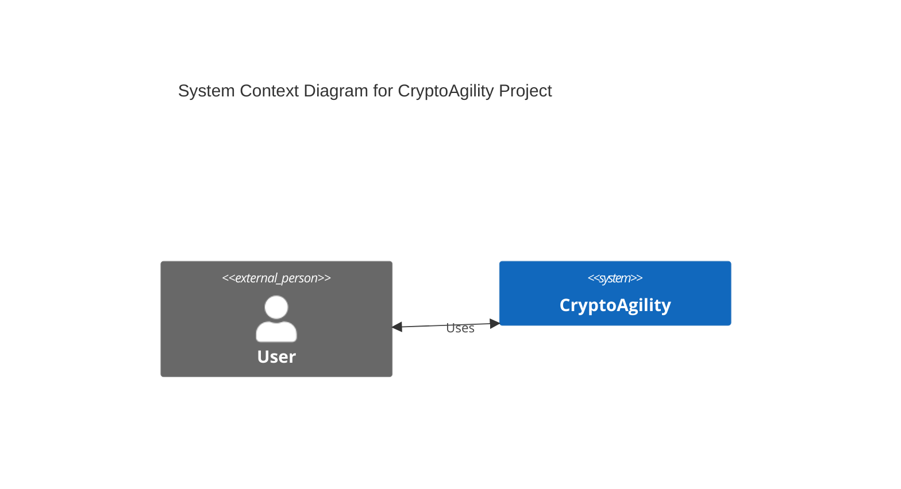
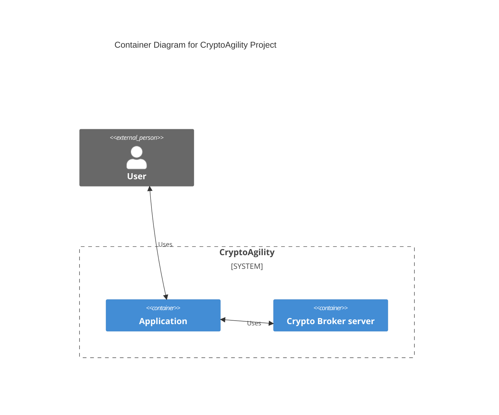
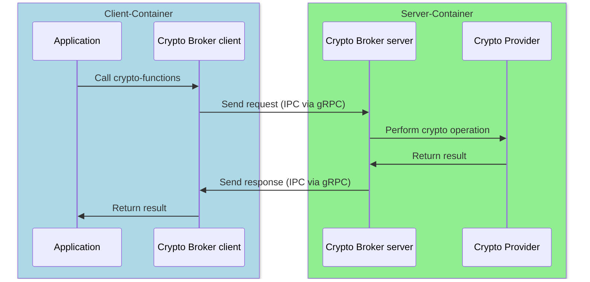
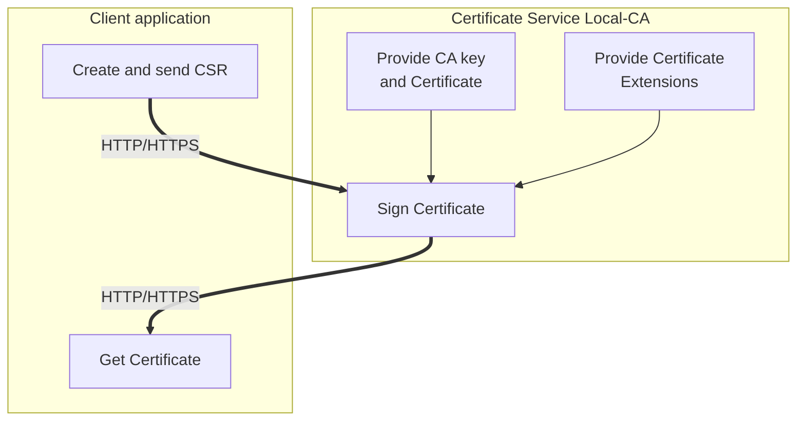
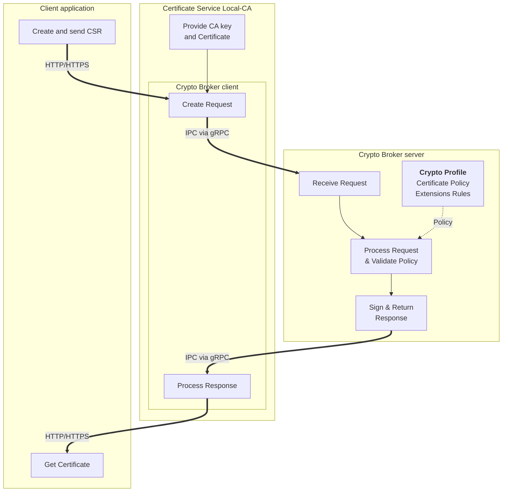

# Crypto Broker - Architecture Description

## Table of Contents

1. [Overview](#overview)
2. [System Architecture](#system-architecture)
3. [Component Description](#component-description)
4. [Communication Architecture](#communication-architecture)

---

## Overview

The Crypto Broker is a cryptographic service that provides crypto agility by offloading cryptographic operations from applications.
It can be deployed in any environment—cloud, on-premises, or local—as long as the core deployment requirements are met: the server
and client must run on the same host but in separate processes, communicating via Unix domain sockets. It follows a sidecar pattern
where applications delegate cryptographic operations to a dedicated server component, enabling centralized crypto policy management,
easy algorithm updates, and compliance with regulatory requirements such as FIPS 140-3.

### Key Features

- **Crypto Agility**: Switch cryptographic algorithms without code changes, responding quickly to security vulnerabilities and compliance requirements
- **Centralized Cryptographic Operations**: Profile-based configuration for consistent crypto policy management across applications
- **Multi-Language Support**: Client libraries available in Go and JavaScript/Node.js (with more languages planned)
- **FIPS 140-3 Compliance**: Built-in support for FIPS 140-3 validated cryptographic modules
- **Cloud-Native**: Deployable on Cloud Foundry and Kubernetes
- **High Performance**: Optimized communication via gRPC over Unix domain sockets
- **Observability**: OpenTelemetry tracing support for distributed observability

---

## System Architecture

The Crypto Broker follows the C4 model for architectural documentation. The system consists of multiple repositories, each serving a specific purpose:

### System Context

The System Context diagram shows the highest-level view of the CryptoAgility project. Users interact with the system to perform cryptographic operations. This abstraction hides the internal complexity of how cryptographic services are delivered, focusing on the external boundary of the system.

### Container View

The Container diagram reveals the internal structure of the CryptoAgility system. It shows two primary containers: the Application (which integrates the client library) and the Crypto Broker server. This illustrates the sidecar pattern where both containers run on the same host, with the application using the Crypto Broker to handle all cryptographic operations. Users interact directly with the application, which transparently delegates crypto tasks to the server.

### Request Flow

The Request Flow sequence diagram illustrates both the deployment model and the complete lifecycle of a cryptographic operation request. The diagram shows two separate containers/processes (Client-Container and Server-Container) representing the sidecar deployment pattern.

**Communication within containers** (inside the colored boxes) occurs through direct function calls:

- Application → Crypto Broker client: In-process API call
- Crypto Broker server → Crypto Provider: In-process crypto function invocation

**Communication between containers** (crossing box boundaries) uses Inter-Process Communication (IPC) via gRPC over Unix domain sockets:

- Crypto Broker client → Crypto Broker server: gRPC request serialization and Unix socket transmission
- Crypto Broker server → Crypto Broker client: gRPC response serialization and Unix socket transmission

This architecture clearly separates the application/client container from the cryptographic server container, enabling independent deployment, restart, and scaling while maintaining high-performance local communication.

### Use Case Example: Certificate Signing Service

This section demonstrates how the Crypto Broker architecture applies to a real-world scenario based on the Certificate Service use case. In this example, a certificate service application runs a local certificate authority (CA) that provisions certificates for client applications.

#### Traditional Certificate Service Architecture

In a traditional setup, the certificate service directly handles all cryptographic operations. When a client requests a certificate:

1. Client application creates and sends a Certificate Signing Request (CSR) via HTTP/HTTPS
2. Local CA receives the CSR
3. Local CA retrieves the CA signing key and certificate
4. Local CA applies pre-defined certificate extensions
5. Local CA signs the certificate using its private key
6. Signed certificate is returned to the client

**Limitations of Traditional Approach**:

- Cryptographic logic embedded in application code
- Algorithm changes require code modifications and redeployment
- Difficult to enforce consistent crypto policy across multiple services
- Compliance updates (e.g., algorithm deprecation) require application updates

#### Crypto Broker-Enhanced Architecture

Using the Crypto Broker, the certificate service delegates cryptographic operations to a dedicated server while retaining control of certificate lifecycle management:

1. Client application creates and sends CSR via HTTP/HTTPS to the certificate service
2. Certificate service receives the CSR
3. Certificate service uses the **Crypto Broker client** to prepare the signing request
4. Request is sent via **IPC (gRPC over Unix socket)** to the Crypto Broker server
5. Crypto Broker server validates the request against the **Crypto Profile** (certificate policy and extensions)
6. Crypto Broker server performs the signing operation using the provided CA key
7. Signed certificate is returned via IPC to the certificate service
8. Certificate service returns the signed certificate to the client via HTTP/HTTPS

**Benefits of Crypto Broker Integration**:

1. **Crypto Agility**: Algorithm changes require only profile updates, not code changes
   - Switch from ECDSA P-256 to P-384 without redeploying the certificate service
   - Update certificate extension policies centrally

2. **Separation of Concerns**:
   - Certificate service focuses on business logic (CSR validation, lifecycle management)
   - Crypto Broker handles cryptographic operations and policy enforcement

3. **Consistent Policy Enforcement**:
   - Crypto Profile defines certificate attributes, key usage, and validity rules
   - Same profile can be shared across multiple certificate services
   - Policy updates apply immediately without service restarts

4. **Compliance and Auditability**:
   - All cryptographic operations traced via OpenTelemetry
   - FIPS 140-3 compliance enforced at the Crypto Broker level
   - Centralized audit trail for certificate signing operations

5. **Security Isolation**:
   - CA private key passed per-request (not persisted by Crypto Broker)
   - Cryptographic operations isolated in separate process
   - File system permissions control access to Unix socket

This example demonstrates the core value proposition: applications delegate cryptographic complexity to the Crypto Broker while maintaining full control over their business logic and certificate lifecycle management.

---

## Component Description

### 1. Crypto Broker Server

**Repository**: `crypto-broker-server`

The Crypto Broker Server is the core component that:

- Creates a Unix Domain Socket at `/tmp/cryptobroker.sock` and listens for incoming requests
- Processes and validates cryptographic operation requests from clients
- Executes cryptographic operations using Go's crypto libraries
- Returns results or error notifications to clients
- Supports multiple cryptographic profiles for different compliance requirements

**Key Capabilities** (current, with ongoing expansion):

- **Hash Operations**: SHA-2, SHA-3 family algorithms (additional algorithms planned)
- **Certificate Signing**: Generate X.509 certificates from CSRs
- **Health Checks**: gRPC health check protocol support
- **Benchmarking**: Built-in performance testing capabilities
- **OpenTelemetry**: Distributed tracing for observability
- **Future Operations**: Encryption/decryption, key derivation, MAC operations, and more in development

**Configuration**:

- Profile-based cryptographic policy configuration (YAML)
- Environment variable configuration for logging, paths, and telemetry
- FIPS 140-3 mode enabled at build-time

### 2. Crypto Broker Client

**Repositories**: `crypto-broker-client-go`, `crypto-broker-client-js`

The Crypto Broker Clients are librariies that provide a simple, consistent API across programming languages. They:

- Abstract the complexity of gRPC communication
- Establish and manage Unix socket connections
- Provide idiomatic APIs for each language
- Handle request serialization and response deserialization
- Support retry policies and error handling

**Available Implementations**:

- **Go Client**: Native Go library for Go applications
- **JavaScript/Node.js Client**: TypeScript-based library for Node.js applications
- **Future**: Additional language support planned

**API Operations** (currently available, expanding):

- `HealthCheck()`: Server health status
- `HashData()`: Compute cryptographic hashes
- `SignCertificate()`: Generate signed X.509 certificates
- `BenchmarkData()`: Run performance benchmarks
- Additional operations for encryption, key derivation, and MAC are under development

### 3. Crypto Broker CLI

**Repositories**: `crypto-broker-cli-go`, `crypto-broker-cli-js`

Command-line interface applications that:

- Demonstrate client library integration
- Serve as testing and validation tools
- Provide examples for application developers
- Used in end-to-end testing pipelines

**Use Cases**:

- Development and testing
- Known-Answer-Tests (KAT) validation
- Performance benchmarking
- Integration examples

### 4. Crypto Broker Deployment

**Repository**: `crypto-broker-deployment`

Provides deployment configurations and end-to-end tests for:

- **Cloud Foundry**: Manifest files and sidecar configuration
- **Kubernetes**: Helm charts for K8s deployment
- **Docker**: Docker Compose configurations for local testing
- **E2E Testing**: Comprehensive test suite validating all components

**Testing Capabilities** (current suite, continuously expanding):

- Health check tests
- Hashing and signing operation tests
- Benchmark tests
- Client compatibility matrix generation
- Cross-platform builds (multiple OS/architecture combinations)
- Additional test scenarios for upcoming crypto operations in development

### 5. Crypto Broker Documentation

**Repository**: `crypto-broker-documentation`

Contains comprehensive documentation including:

- **Architecture Diagrams**: C4 model diagrams, sequence diagrams, activity diagrams
- **Specifications**: Client API, server behavior, profile structure
- **ADRs (Architectural Decision Records)**: Design decisions and rationale
- **API Documentation**: Complete API reference

### 6. Crypto Broker Proto

**Repository**: `crypto-broker-proto`

Defines the Protocol Buffer schemas for:

- Request and response message structures
- gRPC service definitions
- Shared types and enumerations

Included as a Git submodule in both server and client repositories to ensure consistency.

---

## Communication Architecture

### Protocol Selection: gRPC over Unix Domain Sockets

**Why gRPC?**

The Crypto Broker uses gRPC as the communication protocol between client and server. This decision (documented in ADR-0004) was made based on:

**Advantages of gRPC**:

- **Compact Binary Format**: Protobuf is more efficient than JSON, especially for binary data (certificates, keys)
- **Type Safety**: Strong typing and schema validation
- **Streaming Support**: Built-in support for bidirectional streaming (future use cases)
- **Tooling**: Excellent code generation for multiple languages
- **Performance**: Better throughput for larger payloads and concurrent requests
- **HTTP/2**: Multiplexing, header compression, and flow control

**Performance Comparison**:

The protocol selection was evaluated through comprehensive benchmarking as documented in ADR-0004. The evaluation compared gRPC and HTTP across 1000 samples per combination, testing hash and sign operations with both native Go crypto and OpenSSL in Docker and local environments.

**Key Findings from ADR-0004**:

- **Payload Efficiency**: Protobuf binary encoding reduces payload size by 30-40% compared to JSON, especially significant for certificate operations containing binary data (CSR, private keys, CA certificates)
- **Latency**: For small payloads (hash operations), protocol latency difference is marginal; for larger operations (certificate signing), gRPC shows measurable performance improvement
- **Concurrency**: gRPC performs significantly better with concurrent requests due to HTTP/2 multiplexing capabilities
- **IPC Overhead**: Net transmission time (client_duration - server_duration) is consistently lower for gRPC
- **Computational Dominance**: When using OpenSSL as crypto provider, the computational overhead dominates, making IPC protocol choice less impactful on total latency

**Note**: HTTP support has been removed from the current implementation. The Crypto Broker exclusively uses gRPC over Unix domain sockets.

### Unix Domain Sockets

Communication occurs over Unix domain sockets at `/tmp/cryptobroker.sock`:

**Benefits**:

- **Performance**: No network stack overhead
- **Security**: File system permissions control access
- **Simplicity**: No port management or network configuration
- **Local-only**: Prevents remote attacks by design

**Deployment Model**:

- Server and client run in separate containers/processes on the same host
- Shared volume mount for the socket file
- Client connects via the socket path, establishes gRPC connection
