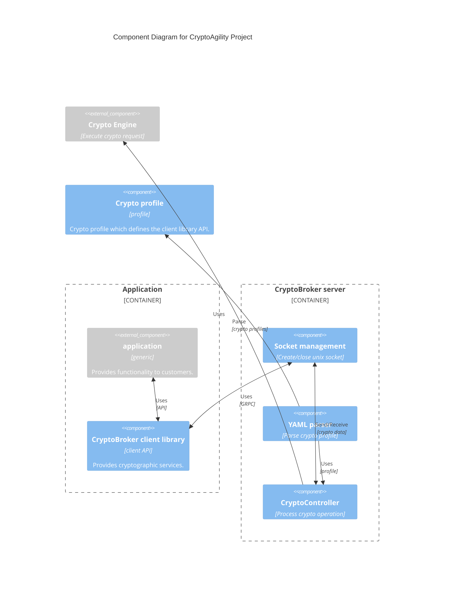

```mermaid
C4Component
    title Component Diagram for CryptoAgility Project

    Container_Boundary(App, "Application") {
        Component_Ext(app, "application", "generic", "Provides functionality to customers.")
        Component(cbcl, "CryptoBroker client library", "client API", "Provides cryptographic services.")
        BiRel(app, cbcl, "Uses", "API")
    }

    BiRel(cbcl, socket, "Uses", "GRPC")

    Container_Boundary(cbs, "CryptoBroker server") {
        Component(socket, "Socket management", "Create/close unix socket")
        Component(yaml, "YAML parser", "Parse crypto profile")
        Component(crypto, "CryptoController", "Process crypto operation")

        BiRel(socket, crypto, "Send/Receive", "crypto data")
        Rel(yaml, crypto, "Uses", "profile")
    }

    Component_Ext(cryptoEngine, "Crypto Engine", "Execute crypto request")
    Rel_Down(crypto, cryptoEngine, "Uses")

    Component(profile, "Crypto profile", "profile", "Crypto profile which defines the client library API.")
    Rel(yaml, profile, "Parse", "crypto profiles")

```
