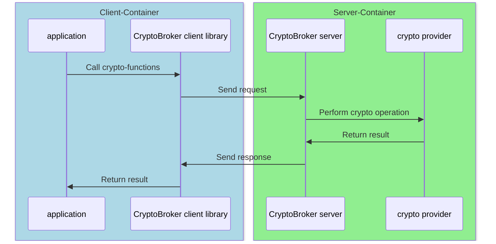

# Sequence Diagram

```mermaid
sequenceDiagram
    box LightBlue Client-Container
    participant application
    participant CryptoBroker client library
    end
    box LightGreen Server-Container
    participant CryptoBroker server
    participant crypto provider
    end
    application ->> CryptoBroker client library: Call crypto-functions
    CryptoBroker client library ->> CryptoBroker server: Send request
    CryptoBroker server ->> crypto provider: Perform crypto operation
    crypto provider ->> CryptoBroker server: Return result
    CryptoBroker server ->> CryptoBroker client library: Send response
    CryptoBroker client library ->> application: Return result
```
